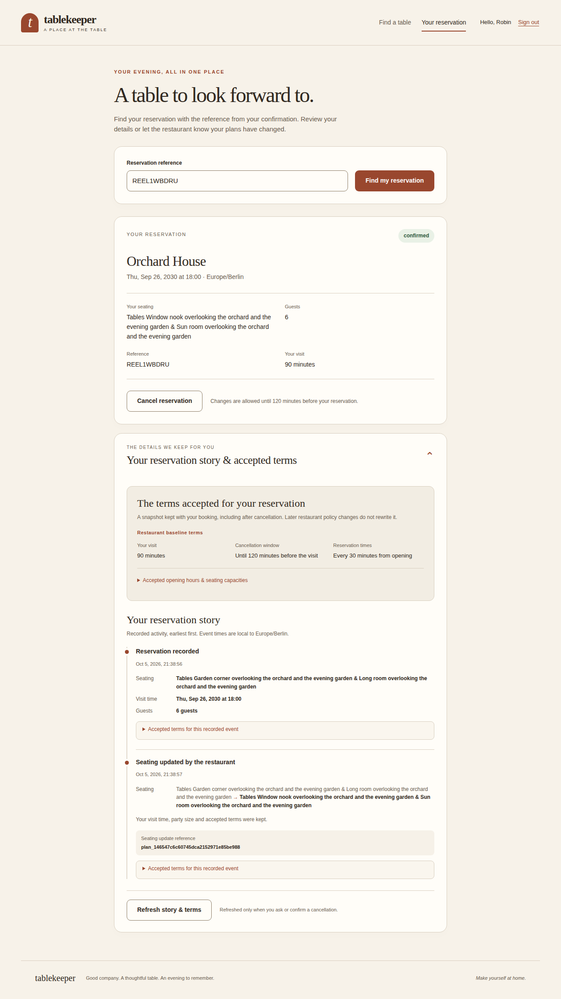

# Tablekeeper — Spec-to-Proof Autonomous Factory

> A four-stage Tablekeeper submission produced by a five-seat autonomous software factory in BAND Desktop, with independent exact-revision verification and zero human steering after the initial dispatch.

## Submission snapshot

| Result | Outcome |
|---|---:|
| **Completed stages** | **4 / 4** |
| **Fresh cumulative official checks** | **575 / 575** |
| **Required populated upgrade paths** | **6 / 6 passed** |
| **Unresolved CRITICAL/HIGH product defects** | **0** |
| **Additional human input after dispatch** | **NONE** |
| **Measured judged-run interval** | **5h 39m 06s** |
| **Final accepted Stage 4 production SHA** | `e0caa7221dc63638418768801eed24fc5ed9b7b0` |

**Track:** Tablekeeper  
**Team:** aitu

### Team members

- Nurali Kuzhagaliev
- Abylay Tabayev
- Nuraiym Kilybayeva
- Mariyam Murzagaliyeva

## Product preview



The browser experience is a real hospitality product, not a verification dashboard. It was validated on desktop and at 375px mobile width, including keyboard/focus behavior, loading/empty/error/uncertain/success states, stale-response protection, lost-response recovery, reservation lookup, accepted terms, and reassigned seating history.

## Live demo

**Public Stage 4 demo:**  
https://tablekeeper-spec-to-proof-factory.onrender.com

**Demo account**

```text
Email: demo@example.com
Password: password123
```

The hosted demo runs the same Stage 4 service as the submission. The application intentionally uses in-memory state, so the free Render instance may restart and return to an empty catalogue. The judged repository itself does not depend on Render or any external state service.

Quick health check:

```text
https://tablekeeper-spec-to-proof-factory.onrender.com/health
```

If the restaurant catalogue is empty, seed the demo once using [`demo/seed.json`](demo/seed.json).

### macOS / Linux / Git Bash / modern Windows curl

Hosted demo:

```bash
curl -X POST \
  "https://tablekeeper-spec-to-proof-factory.onrender.com/_test/reset" \
  -H "Content-Type: application/json" \
  --data-binary @demo/seed.json
```

Local Docker instance:

```bash
curl -X POST \
  "http://localhost:8080/_test/reset" \
  -H "Content-Type: application/json" \
  --data-binary @demo/seed.json
```

### PowerShell

Hosted demo:

```powershell
Invoke-RestMethod `
  -Uri "https://tablekeeper-spec-to-proof-factory.onrender.com/_test/reset" `
  -Method Post `
  -ContentType "application/json" `
  -InFile ".\demo\seed.json"
```

Local Docker instance:

```powershell
Invoke-RestMethod `
  -Uri "http://localhost:8080/_test/reset" `
  -Method Post `
  -ContentType "application/json" `
  -InFile ".\demo\seed.json"
```

Expected restaurants after seeding:

- Maison Aurelia
- Osteria Verde
- Atelier Lumiere
- Sakura House
- Ember & Oak
- Nocturne Dining

---

## Choose how you want to evaluate it

### Option A — Open the live demo

1. Open https://tablekeeper-spec-to-proof-factory.onrender.com
2. If the catalogue is empty, run one of the seed commands above and refresh.
3. Sign in with `demo@example.com` / `password123`.
4. Search availability.
5. Choose a table and make a reservation.
6. Open **Your reservation** to inspect the confirmation, current seating, history, and accepted terms.

### Option B — Run the accepted Stage 4 service locally with Docker

```bash
git clone https://github.com/NuraliKuzhagaliev/tablekeeper-spec-to-proof-factory.git
cd tablekeeper-spec-to-proof-factory/stage-4

docker build -t tablekeeper-stage-4 .
docker run --rm -e PORT=8080 -p 8080:8080 tablekeeper-stage-4
```

Then open:

```text
http://localhost:8080/
```

Health:

```text
http://localhost:8080/health
```

To install the same six-restaurant demo catalogue, return to the repository root and run one of the local seed commands above.

### Option C — Inspect the judged submission and factory evidence

Start here:

1. **[FACTORY.md](FACTORY.md)** — reusable factory architecture, setup, design choices, measured time/spend, failure handling, and recovery
2. **[FINAL_REPORT.md](FINAL_REPORT.md)** — final run metrics, limitations, contributions, and accepted production SHAs
3. **[evidence/final/official-all-stages.md](evidence/final/official-all-stages.md)** — fresh final cumulative official gate
4. **[evidence/releases/](evidence/releases/)** — stage release provenance
5. **[room.json](room.json)** — full BAND room transcript for the submitted autonomous run
6. **Git history** — implementation, independent rejection, repair, verification, stage progression, and release provenance

---

## Why this submission is different

The factory does not use “visible tests are green” as its acceptance rule.

```text
specification
→ atomic requirements + risk model
→ implementation
→ exact production SHA
→ independent verification
→ ACCEPT / REJECT
→ root-cause repair
→ re-verification
→ compatibility / upgrade proof
→ release
```

A real independent rejection occurred in the judged run. The first Stage 1 production revision was rejected for HIGH-severity specification defects, repaired in a new commit, and accepted only after independent re-verification.

Initial rejected production SHA:

```text
b03ce55647b70a46f478ea50ba077e02945bcefe
```

Repaired and independently accepted Stage 1 SHA:

```text
d41a7627711951a07ce7a1718fac47c6ea5b6dd4
```

The failed revision, repair, and acceptance chain remain visible in Git history and `room.json`.

## Factory

| Seat | Role |
|---|---|
| **Conductor** | Orchestration, complete handoffs, progression, repair routing, release control |
| **Contract Auditor** | Atomic specification ledger, risk model, traceability, compatibility obligations |
| **Systems Engineer** | Core production semantics, state transitions, concurrency, migrations, implementation tests |
| **Experience Engineer** | Responsive browser UX, accessibility, async-state correctness, product polish |
| **Adversarial Verifier** | Independent exact-SHA verification, oracles, concurrency/upgrades, formal verdicts |

The verifier never repairs production. Production owners never self-accept.

See **[FACTORY.md](FACTORY.md)** for the complete reusable factory design and **[mandates/](mandates/)** for the generic permanent seat mandates.

## Stage results

| Stage | Accepted production SHA | Official cumulative checks |
|---|---|---:|
| **Stage 1** | `d41a7627711951a07ce7a1718fac47c6ea5b6dd4` | **120 / 120** |
| **Stage 2** | `2c431f7e6c0c5ed3bdae232bde255ec24c1bbab3` | **145 / 145** |
| **Stage 3** | `0ca5880272740494e541a903a49ea423c6e8ce2b` | **152 / 152** |
| **Stage 4** | `e0caa7221dc63638418768801eed24fc5ed9b7b0` | **158 / 158** |

Final fresh all-folder isolated verification:

```text
575 / 575 applicable checks PASS
highest contiguous stage: 4
folder claims: 1 / 2 / 3 / 4
```

## Upgrade continuity

All six required populated paths passed:

- Stage 1 → Stage 2
- Stage 1 → Stage 3
- Stage 2 → Stage 3
- Stage 1 → Stage 4
- Stage 2 → Stage 4
- Stage 3 → Stage 4

## Repository map

```text
.
├── README.md
├── FACTORY.md
├── FINAL_REPORT.md
├── demo/
│   └── seed.json
├── mandates/
├── room.json
├── evidence/
├── stage-1/
├── stage-2/
├── stage-3/
└── stage-4/
```

## Runtime and cost

All five BAND seats used **Codex / gpt-6.1-sol** with high reasoning.

Measured judged-run interval:

```text
5h 39m 06s
```

BAND reported a catalog-equivalent estimate of approximately:

```text
USD 38.67
```

This is a tooling estimate, not claimed provider billing.

## Autonomy

After the initial dispatch, the submitted judged run required:

- no human clarification
- no human approval
- no human debugging
- no implementation hints
- no “continue” messages
- no human-triggered stage reruns

## Final outcome

**4 / 4 stages independently accepted.**  
**575 / 575 applicable fresh cumulative checks passed.**  
**6 / 6 required populated upgrade paths passed.**  
**0 unresolved CRITICAL/HIGH product defects.**  
**0 additional human steering after the initial dispatch.**
