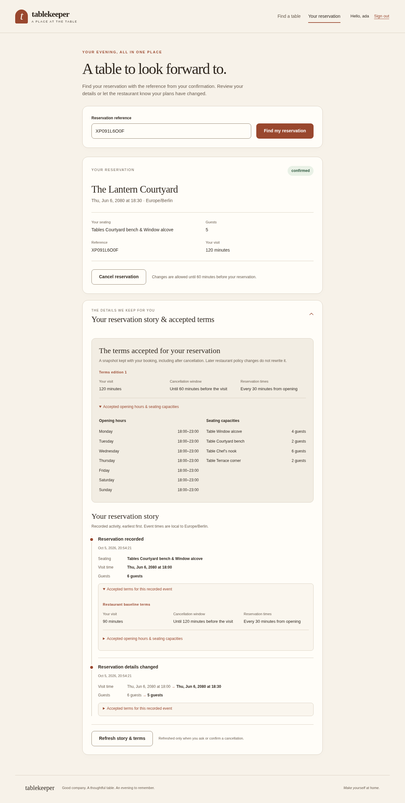

# Stage 3 cumulative independent verification

VERDICT: ACCEPT

REVISION: 0ca5880272740494e541a903a49ea423c6e8ce2b

SPECIFICATION COVERAGE: All 557 canonical obligations closed on this revision: 249 CRITICAL, 285 HIGH and 23 MEDIUM, through all 64 V/W/Z evidence profiles below. Authority is the complete cumulative Stage 1–3 contracts, release STAGE3-INTEGRATED-VERIFY-RELEASE-001 (message 7a5f108c-97df-4943-8b41-877240dedf7e), and ledger FULL 429c365ae5e36a02883d10d36efed26dcc32a6fa. The canonical requirement file is untouched. Current execution, source/provenance inspection and rendered review support closure; earlier acceptance and owner results do not substitute for it.

OFFICIAL CHECKS: Isolated cumulative harness PASS: Stage 1 120/120, Stage 2 25/25, Stage 3 7/7, total 152/152. Zero failures, errors, skips, deselections or xfails in applicable suites. Official checkout FULL 803560d2a678ace1414465c098eb0ab5380ffade, suite digest 2f27c2abe7e225758da8e656d354896e527953af8cd7ea3cbb9e3d336ac211c2. Run completed from 2026-10-05T18:44:52.893233+00:00 to 18:45:55.594873+00:00, 62.702 seconds. Later-stage probing is outside this verdict. Upgrade suites use the frozen lower-stage directories in the exact clone; independent populated direct upgrades additionally use separately built accepted Stage 1 and Stage 2 revisions.

INDEPENDENT ROBUSTNESS CHECKS: 88 distinct passing macro groups: 29 inherited API, 12 pair API, 13 core Stage 3 API, 11 further Stage 3 API, 9 retained browser, 8 retained explicit API/browser protocols and 6 disclosure/browser groups. 2987 reported instrumented API-only observations across preserved checkpoints, including repeated checks/controls; browser traffic, browser setup and some legacy setup calls are additional and excluded. No claim of distinct transactions or exhaustive input coverage follows from this count. Instrumented responses enforce actual 5-second ordinary and 10-second control budgets, JSON/error envelopes and absence of 5xx. No unresolved PRODUCT DEFECT, VERIFIER COVERAGE GAP or INCONCLUSIVE blocking obligation remains.

COMPATIBILITY CHECKS: Separately started accepted Stage 1 d41a7627711951a07ce7a1718fac47c6ea5b6dd4 and Stage 2 2c431f7e6c0c5ed3bdae232bde255ec24c1bbab3 export populated amended/confirmed/cancelled records, genuine sessions and historical original create/batch receipts into this revision. Every saved original response remains exact JSON, including absent newer fields; current records receive revision/whole accepted terms. Hashed login, multiple valid tokens, IDs/references/status/timestamps, failed-key reuse, destination erasure and adoption work after import. Direct legacy sources are paused and share no volumes. Native A→B→C transfer preserves policies, history, agreements, exceptions and all four receipt families; invalid/repeated import and reset preserve replacement/rollback rules. Both genuine Stage 1→3 and Stage 2→3 same-tab pending requests recover original receipts without reload, keeping the old token, reference, form, exact body/key and human labels. Native pair lost-response import/retry passes too.

CLEAN-ENVIRONMENT CHECKS: Exact read-only native detached --no-hardlinks clone /tmp/av-stage3-0ca588027274-f854babf-4kttpn35/candidate, clean HEAD checked before and after execution. Stage 3 tree 6db40e3e5b32431d5cb976f67b8be33c633da6ae. Separate copied baseline 8ff03e10cd8fad43feee089aabbfa6d3a072e818 has exactly the accepted Stage 2 tree 5e0f3ee38f68f7cb846b28c5dbd1850e7b768f91. Frozen Stage 1 tree 7d35fe7568addec4437c2eb8705ed788ed46f0f2 and earlier source/evidence have no tracked working diff. Harness describes submitted source as working-tree provenance; clean committed blob/tree binding establishes the exact immutable content. Docker 29.8.0, Python verifier 3.14.4, observed host 20 CPUs/8125067264 bytes. Unique services enforce 2 vCPU/2147483648-byte limits on an internal offline network, no shared volume, local packaged assets/tzdata. Default 8080 and custom ports work. Only owned verifier resources were removed; final owned-container queries are empty.

KNOWN LIMITATIONS: Ephemeral state is permitted. Tested finite scenarios establish observed budgets, not unlimited dataset performance. Arbitrarily disparate compact fixture capacities can require mathematically unbounded exact output; finite resources cannot prove unlimited output. No unsupported numeric range, rounding or feasible-case waiver is adopted. New policy capacities 1..100 do not retroactively limit policy-0/legacy values. Gap-valued business-hour boundaries and unspecified error ties remain interpretation boundaries. No future-stage API/counter rule, downgrade, cross-tab synchronization or reload recovery is claimed.

EVIDENCE ARTIFACTS: This consolidated report, coverage.json containing stable IDs/profiles/cases/counts/checkpoint identities, executable independent campaigns/oracles/runtime probe, and two actually reviewed synthetic screenshots. Evidence FULL commit is reported separately in the room handoff. No raw exports, credentials, tokens, passwords, environments, private diagnostics or caches are committed. preparation.json is an uncommitted historical offline preparation artifact; it is not final closure evidence.

## Observed budgets, exact values and source corroboration

Maximum reported instrumented ordinary API latency 0.102837 seconds (5-second budget); control 0.100700 seconds (10-second budget). Main health observations from actual Docker StartedAt: source 0.807s, destination 0.766s, third 0.844s, accepted Stage 1 0.836s, Stage 2 0.829s; all within 60 seconds. Standalone Windows-client published-port probe used actual Docker mapping 127.0.0.1:55249, custom PORT=8987, readiness 1.006s, reset204 in 0.094722s and read200 in 0.0855355s. Inspected limits 2000000000 NanoCpus/2147483648 bytes; offline runtime is independently proven on the main internal network. Macro durations include many requests, temporal waits or held callbacks and are not single-request latencies.

Independent Fraction/Decimal/integer arithmetic checks feasible exact sums with 19, 57, 310, 1001 and 2049 digits, disparate exponents, capacity−1/capacity/capacity+1 thresholds, exact full-body numeric equivalence versus distinct high-precision values, booleans, ignored huge/tiny valid values, and rejection of non-JSON NaN/Infinity. Historical originals and full policy-0 capacities remain exact through cancellation and cross-process replacement. Arbitrary valid calendar bounds/grid termination, restaurant-scoped duplicate table IDs, short seeded password continuity, all four prescribed DST transitions and half-open adjacency were reexecuted.

Exact-source inspection corroborates standard-library implementation provenance, original domain code, scrypt account storage with random salts (n=16384,r=8,p=1), validated imported hashes, constant-time verification, one observable state lock, immutable completed receipt copies, and fully bundled runtime assets. RUN.md provides the standalone build/start command. These internal/provenance checks support relevant obligations; production decision functions are never imported into an oracle.

## Policy, history, recurrence and concurrency evidence

The independent model selects the greatest eligible local effective date, then greatest publication version on a tie. Publication order, future/past dates and local date differing from UTC are distinct test vectors. Complete field/range/key-set validation, manager permissions, per-restaurant version continuity and user/path/full-body receipt identity pass. Public detail remains the original fixture while current slot grids/durations/capacities follow selected policies. Explanation independently reports capacity and retained-interval overlap for every table in fixture order, including both-false tables and occupied fitting slots.

Whole accepted terms, end times, revisions and old event snapshots remain immutable under new/backdated policies. Real changes check old accepted cutoff before validating all merged result fields under the resulting local date's policy. Empty, same-value, unknown-only and reversed-pair no-ops preserve terms/end/revision/history while still requiring editable confirmed state. Valid stale revisions precede cutoff/proposed-field validation. History actual changes use declared member order, null creation sources and ordered changed fields; seq is contiguous, times nondecreasing, cancellation empty/terminal. History/decision anonymous, unknown-token, foreign-diner and nonowner-manager responses all use indistinguishable404.

Adoption preserves the current amended single/pair anchor exactly, including identity, history, terms, revision, dates and old receipt. Count2/12 and interval1/4, policy selection for each calendar occurrence, first generated error, gap rejection/first fold, grid/closed/capacity/member conflicts and terminal calendar rollback pass. Indices/references survive date reorder. Real individual changes make permanent exceptions and increment agreement once; cancellation retains siblings and does not newly mark an exception; no-op/failure/replay/repeated cancel changes nothing. Collective final states allow legal swaps while retaining unchanged occupancy; per-item nonoccupancy/input order precedes final overlap, failed state/keys are unchanged.

Private opaque snapshot structure is decoded only to compare explicit Stage 3 counter deltas and full before/after state, never to reuse decision logic. Adoption increments restaurant once; real batch increments restaurant once and each actually affected series once. All-no-op batch and unchanged-only series counters remain unchanged. No general Stage 4 counters are imposed. Imported amended/cancelled records with unknown past use immutable legacy_baseline known_state outside the event timeline and empty entries; cancelled fixtures use fixture_baseline. Future observed native events begin seq1 without invented historical timestamps or edits.

Coordinated 50-way create retries/contention, changed-key races, policy same/different-key writes, maximum-count adoption retries and stale CAS amendments have permitted response/state outcomes. Exactly one first-use201 plus49 identical200 replays occurs for identical successful keys. Fifty CAS contenders admit one real revision change. Twenty-five batch retries with25 simultaneous snapshots verify each imported snapshot is entirely before or after, including occupancy, terms, histories and receipt. Pair/member reads and inherited reset/import/PATCH/cancel races remain atomic. Eight bounded mixed policy/PATCH/cancel trials compare outcomes with all six independently enumerated serial orders; pair/PATCH/create serial calibration also passes.

Twenty controlled wrong Stage 3 model observations are detected, covering date/tie selection, folded/gap calendar behavior, whole terms, actual pair history, no-op/stale/full-result semantics and explicit counter deltas. Retained earlier member/time/exact-number calibrations also pass. Calibration evaluates the verifier; candidate success is established separately by execution.

## Independent browser and rendered product review

Actual packaged HTML routes and all Stage 2 hooks/flows pass at375 and1280 CSS pixels, including public search, auth/current-user/logout, single/pair grids, unavailable inert cells, keyboard selection/form submission/focus, visible associated labels and offline local assets. Long restaurant/member labels wrap with no horizontal page scrolling. Inspected native-history screenshots show a coherent cream/terracotta hospitality product, readable hierarchy, human pair names/local times and historical90-minute versus current120-minute terms. The screenshots contain synthetic identities/reference labels only.

Available, unavailable and selected seating, loading/empty/no-seats, refusal, uncertainty and confirmation are distinct. Computed composited contrast and visible focus/label metrics corroborate actual rendered review; no invented numeric visual threshold is used. Delayed search/details/selection/refresh, submitted intent/user and lookup/cancel responses cannot restore stale intent. Conflict retains the form/inputs and refreshes authoritative availability. Loss before/after commit and unreadable committed response shows uncertainty; unchanged retry contacts server with identical body/key and recovers the original reference, while changed input uses a new identity. Both legacy same-tab upgrade variants keep genuine old session/reference/pending identity without reload.

Optional on-demand history/decision disclosure displays actual server sequence/changes, whole old/current accepted terms and native versus documented known-state baselines. Network,404, unreadable and revision-mismatch feedback stays contained; required lookup/cancel remains usable. Held replies across reference, logout/new user, navigation and cancellation cannot replace current disclosure. Final recovered disclosure runs have zero page errors. No new screen or test-dashboard workflow is required.

## Recovery and classification

Preserved initial checkpoint f854babf completed official152 and core/inherited/pair/browser passes. Its Stage 2 browser-source receipt assertion incorrectly demanded the older Stage 1 shape without table_ids: VERIFIER DEFECT. The owned cumulative browser copy now recognizes a genuine Stage 1 or Stage 2 old receipt while requiring absent Stage 3 enrichment and exact original replay; 0dc39521 closes the Stage 2 same-tab variant. Frozen earlier verifier/source/evidence remains unchanged.

Initial disclosure controls used a strict locator matching two summary elements and disposed Playwright response handles during failed cleanup: VERIFIER DEFECTS. Narrowed locator, copied response bytes and bounded handler draining preserve valid passing evidence; 4965d3e9 closes native/partial/race checks. Fixture/legacy setup then waited for a cached same-user display and submitted before reauthentication finished after state replacement: VERIFIER DEFECT. Explicit verifier logout before login closes fixture/legacy baseline and switched-user checks in0c07c632. No production code or official check changed. Further API boundary expansions pass in045d3fee/76868839. No product repair or infrastructure workaround was needed for this revision.

## Reproduction and executable identities

Run `python evidence/stage-3/run_campaign.py --released --revision 0ca5880272740494e541a903a49ea423c6e8ce2b --repo /mnt/d/dark/band-work/result` from the verifier venv with the official readonly checkout available. The runner materializes clean native pins, verifies frozen source blobs, runs complete official isolated Stage3, starts independent offline limited containers and executes inherited/pairs/core/browser/extension/addon/disclosure phases. Resume requires an exact materialized pin plus complete official checkpoint with matching revision/digest/counts. `runtime_probe.py --released --revision FULL --materialized NATIVE_PIN` performs the actual assigned published-port probe. prepare.py is offline calibration only and does not issue a verdict.

The final executable identities below distinguish evolving verifier controls from the single immutable production revision. Initial metadata and each preserved checkpoint retain their observed verifier identities. All cumulative verifier copies remain byte-identical to frozen earlier files except the explicit owned legacy-receipt assertion adaptation; lower-stage originals are unchanged. coverage.json records sanitized summary SHA-256 bindings, every passing case and both legacy same-tab variants. Raw diagnostics stay outside result under /mnt/d/dark/band-work/checks; credentials/exports are private and must not be copied into evidence.

| Executable | Final SHA-256 |
|---|---|
| browser_disclosure.py | 4ff2f5c48a062ec18dd329929b26232f9b92b44a91ebc2d8fc4906123abbda42 |
| cumulative/browser_campaign.py | bbb692c3a02d3e54c9f4ce8ca1ecc9e1b045cdcec64c2d2e0418bc96c2c788d9 |
| cumulative/campaign.py | 90e834d3fc9737693a95a616a189e383a52396faecc37109589fc164c81f3c6a |
| cumulative/extensions.py | bb0d09e39971e80e332839a06dd0777ef09aba1a3ce3cdf453f397141b0ef975 |
| cumulative/oracle.py | d66aea543bab43211f44e9be6cf4bd4a25db23353343c79ed767e077acc57198 |
| cumulative/runtime_probe.py | c6eb80924e74c6817761b058b438678aade5c34b99c4db9bc5b63c9bcbff1475 |
| cumulative/stage1_campaign.py | 4fe9e7c5670f89132d36164332c24bf8abe12983c997923efec88a0345707176 |
| policy_oracle.py | b679698c42c321b5480636379e036652846efeb5778dec60b0d7671756c9fc4e |
| prepare.py | 68d44de3c037c8b4be3472c1be45b1af994c141f4a067ca7cd33854d9e72e7ed |
| run_campaign.py | 7cd60e3703dc6aaeee23de3beef334f5cac155b73ae9098ff9d11e5ad892eaae |
| runtime_probe.py | 9a90fda8cdaabad42f7615bf3dbefc5cb31ecde1ed4890d85ec910d4db1b3c69 |
| stage3_campaign.py | cd57b08e83c395083a3d869715463eeafd9550ed9bf7045b43bac176e821bb52 |
| stage3_extensions.py | ea0be3712f37d3b5896e18847a1e18aaa28063ba9a2e467e792e5a5ba8f9a860 |

## Passing exact-revision case checkpoints

| Case | PASS checkpoint | Summary | Seconds |
|---|---|---|---:|
| accepted_cutoff_and_stale_precedence | av-stage3-0ca588027274-4965d3e9 | addons-summary.json | 0.202 |
| adoption_retry_concurrency_50 | av-stage3-0ca588027274-f854babf | core-summary.json | 0.211 |
| amended_pair_anchor_and_legacy_history_baselines | av-stage3-0ca588027274-76868839 | addons-summary.json | 0.446 |
| amendments_atomic_cutoff | av-stage3-0ca588027274-f854babf | inherited-summary.json | 0.197 |
| availability_oracle | av-stage3-0ca588027274-f854babf | inherited-summary.json | 0.423 |
| batch_snapshot_coherence_50 | av-stage3-0ca588027274-f854babf | core-summary.json | 0.429 |
| booking_boundaries_privacy | av-stage3-0ca588027274-f854babf | inherited-summary.json | 0.137 |
| calendar_extremes | av-stage3-0ca588027274-f854babf | inherited-summary.json | 0.091 |
| cancelled_after_cutoff_temporal | av-stage3-0ca588027274-f854babf | inherited-summary.json | 48.349 |
| collective_series_final_state | av-stage3-0ca588027274-f854babf | core-summary.json | 0.126 |
| complete_result_grid_duration_and_history | av-stage3-0ca588027274-4965d3e9 | addons-summary.json | 0.225 |
| concurrency_batch_snapshot | av-stage3-0ca588027274-f854babf | inherited-summary.json | 0.17 |
| concurrency_changed_key_50 | av-stage3-0ca588027274-f854babf | inherited-summary.json | 0.147 |
| concurrency_distinct_50 | av-stage3-0ca588027274-f854babf | inherited-summary.json | 0.159 |
| concurrency_identical_50 | av-stage3-0ca588027274-f854babf | inherited-summary.json | 0.152 |
| concurrency_signup_and_users | av-stage3-0ca588027274-f854babf | inherited-summary.json | 0.225 |
| conflict_preserves_form | av-stage3-0ca588027274-f854babf | browser2/browser-summary.json | 6.916 |
| conflict_refresh_and_frozen_search_intent | av-stage3-0ca588027274-0dc39521 | extensions/extension-summary.json | 11.558 |
| contained_partial_and_mismatch_failures | av-stage3-0ca588027274-4965d3e9 | disclosure/disclosure-summary.json | 4.273 |
| control_receipt_erasure | av-stage3-0ca588027274-f854babf | inherited-summary.json | 0.332 |
| control_replacement_races | av-stage3-0ca588027274-f854babf | inherited-summary.json | 0.305 |
| crossed_detail_closed_and_error | av-stage3-0ca588027274-0dc39521 | extensions/extension-summary.json | 4.493 |
| crossed_reference_and_cancel_reads | av-stage3-0ca588027274-4965d3e9 | disclosure/disclosure-summary.json | 2.285 |
| desktop_long_labels_and_no_seats | av-stage3-0ca588027274-0dc39521 | extensions/extension-summary.json | 6.456 |
| dst_closing_instant_boundaries | av-stage3-0ca588027274-f854babf | inherited-summary.json | 0.368 |
| dst_oracle | av-stage3-0ca588027274-f854babf | inherited-summary.json | 0.196 |
| duplicate_table_ids_and_short_seed_password | av-stage3-0ca588027274-f854babf | inherited-summary.json | 0.196 |
| effective_date_explanations | av-stage3-0ca588027274-f854babf | core-summary.json | 0.242 |
| explicit_restaurant_and_affected_series_deltas | av-stage3-0ca588027274-4965d3e9 | addons-summary.json | 0.152 |
| export_atomic_batch | av-stage3-0ca588027274-f854babf | inherited-summary.json | 0.291 |
| fixture_and_legacy_known_state | av-stage3-0ca588027274-0c07c632 | disclosure/disclosure-summary.json | 2.789 |
| ignored_numeric_receipt_boundaries | av-stage3-0ca588027274-f854babf | inherited-summary.json | 0.231 |
| late_reads_after_user_or_navigation | av-stage3-0ca588027274-0c07c632 | disclosure/disclosure-summary.json | 2.824 |
| legacy_direct_upgrades | av-stage3-0ca588027274-f854babf | core-summary.json | 1.259 |
| local_date_selection_and_privacy_baselines | av-stage3-0ca588027274-4965d3e9 | addons-summary.json | 0.141 |
| lookup_detail_and_cancel_races | av-stage3-0ca588027274-0dc39521 | extensions/extension-summary.json | 8.931 |
| lost_response_recovery | av-stage3-0ca588027274-f854babf | browser2/browser-summary.json | 10.208 |
| mixed_policy_patch_cancel_serial_oracle | av-stage3-0ca588027274-4965d3e9 | addons-summary.json | 0.769 |
| moves_atomic_precedence | av-stage3-0ca588027274-f854babf | inherited-summary.json | 0.155 |
| moves_eight_and_restaurant_scope | av-stage3-0ca588027274-f854babf | inherited-summary.json | 0.117 |
| native_snapshot_four_receipt_families | av-stage3-0ca588027274-f854babf | core-summary.json | 1.217 |
| native_terms_history_visual | av-stage3-0ca588027274-4965d3e9 | disclosure/disclosure-summary.json | 2.561 |
| numeric_equivalence_and_precision | av-stage3-0ca588027274-f854babf | inherited-summary.json | 0.781 |
| offset_ordering_and_amendment | av-stage3-0ca588027274-f854babf | inherited-summary.json | 0.101 |
| out_of_order_search | av-stage3-0ca588027274-f854babf | browser2/browser-summary.json | 2.076 |
| pair_amendment_dst_and_cutoff | av-stage3-0ca588027274-0dc39521 | extensions/extension-summary.json | 0.816 |
| pair_batch_final_state | av-stage3-0ca588027274-f854babf | pairs-summary.json | 0.102 |
| pair_concurrency_50 | av-stage3-0ca588027274-f854babf | pairs-summary.json | 0.291 |
| pair_create_validation | av-stage3-0ca588027274-f854babf | pairs-summary.json | 1.286 |
| pair_dst | av-stage3-0ca588027274-f854babf | pairs-summary.json | 0.368 |
| pair_exact_sum_snapshot_transfer | av-stage3-0ca588027274-0dc39521 | extensions/extension-summary.json | 0.307 |
| pair_model_and_seeds | av-stage3-0ca588027274-f854babf | pairs-summary.json | 0.379 |
| pair_numeric_capacity | av-stage3-0ca588027274-f854babf | pairs-summary.json | 0.551 |
| pair_options_oracle | av-stage3-0ca588027274-f854babf | pairs-summary.json | 0.38 |
| pair_patch_create_serial_oracle | av-stage3-0ca588027274-f854babf | pairs-summary.json | 0.396 |
| pair_patch_replacement_rollback | av-stage3-0ca588027274-f854babf | pairs-summary.json | 0.111 |
| pair_reads_and_atomic_snapshots | av-stage3-0ca588027274-f854babf | pairs-summary.json | 0.386 |
| pair_receipt_array_identity | av-stage3-0ca588027274-f854babf | pairs-summary.json | 0.098 |
| pair_same_tab_import | av-stage3-0ca588027274-f854babf | browser2/browser-summary.json | 2.533 |
| pair_selector_precedence_and_receipts | av-stage3-0ca588027274-0dc39521 | extensions/extension-summary.json | 0.169 |
| pair_snapshot_receipts | av-stage3-0ca588027274-f854babf | pairs-summary.json | 0.669 |
| patch_and_batch_field_validation | av-stage3-0ca588027274-f854babf | inherited-summary.json | 0.261 |
| patch_batch_cancel_replay_races | av-stage3-0ca588027274-f854babf | inherited-summary.json | 0.124 |
| permissions_policy_validation | av-stage3-0ca588027274-f854babf | core-summary.json | 0.311 |
| policy_batch_input_order_and_retained_noop | av-stage3-0ca588027274-4965d3e9 | addons-summary.json | 0.103 |
| policy_limits_and_namespaces | av-stage3-0ca588027274-4965d3e9 | addons-summary.json | 0.19 |
| public_auth_reset | av-stage3-0ca588027274-f854babf | inherited-summary.json | 0.289 |
| publication_concurrency_receipts | av-stage3-0ca588027274-f854babf | core-summary.json | 0.198 |
| receipt_semantics | av-stage3-0ca588027274-f854babf | inherited-summary.json | 0.143 |
| recurrence_first_failure_and_calendar_bounds | av-stage3-0ca588027274-4965d3e9 | addons-summary.json | 0.204 |
| revision_priority_and_concurrency | av-stage3-0ca588027274-f854babf | core-summary.json | 0.259 |
| routes_auth_grid | av-stage3-0ca588027274-f854babf | browser2/browser-summary.json | 3.407 |
| same_tab_upgrade | av-stage3-0ca588027274-0dc39521 | browser2/browser-summary.json | 2.223 |
| seed_ids_and_batch_cutoff | av-stage3-0ca588027274-f854babf | inherited-summary.json | 0.108 |
| selected_policy_search_and_keyboard | av-stage3-0ca588027274-4965d3e9 | disclosure/disclosure-summary.json | 1.787 |
| series_anchor_and_exceptions | av-stage3-0ca588027274-f854babf | core-summary.json | 0.154 |
| series_dst_and_first_error | av-stage3-0ca588027274-f854babf | core-summary.json | 0.38 |
| series_keys_policy_grid_and_closed_occurrences | av-stage3-0ca588027274-045d3fee | addons-summary.json | 0.381 |
| series_reordered_dates_cancelled_exceptions | av-stage3-0ca588027274-4965d3e9 | addons-summary.json | 0.197 |
| series_validation_atomic_failure | av-stage3-0ca588027274-f854babf | core-summary.json | 0.148 |
| signup_keyboard_empty_refused | av-stage3-0ca588027274-f854babf | browser2/browser-summary.json | 2.079 |
| snapshot_import_receipts | av-stage3-0ca588027274-f854babf | inherited-summary.json | 0.734 |
| submitted_user_race | av-stage3-0ca588027274-f854babf | browser2/browser-summary.json | 4.465 |
| success_retry_lookup | av-stage3-0ca588027274-f854babf | browser2/browser-summary.json | 10.813 |
| terminal_zone_instants | av-stage3-0ca588027274-f854babf | inherited-summary.json | 0.21 |
| terms_history_noops_and_pairs | av-stage3-0ca588027274-f854babf | core-summary.json | 0.121 |
| unreadable_and_changed_pending_intent | av-stage3-0ca588027274-0dc39521 | extensions/extension-summary.json | 13.054 |
| validation | av-stage3-0ca588027274-f854babf | inherited-summary.json | 0.126 |

Checkpoint names expand to /mnt/d/dark/band-work/checks/NAME. Both legacy same-tab variants are retained: Stage1 f854babf/browser1 and Stage2 0dc39521/browser2. Published runtime is av-published-0ca588027274-2bf82785. Counter, internal hash/storage and delivery/scope profiles additionally use exact source/provenance and runtime inspection described above.

## Executed evidence profiles

Profiles map canonical obligations to actual cases executed against this revision. V01/W20/Z24 additionally bind source/build/runtime/provenance/release/evidence safety inspections. Every inherited specialization is supplemented by the relevant Z profile and its current-policy/terms/history checks.

| Profile | Passing current-revision case evidence |
|---|---|
| V01 | routes_auth_grid |
| V02 | public_auth_reset, control_replacement_races, duplicate_table_ids_and_short_seed_password |
| V03 | validation, ignored_numeric_receipt_boundaries, numeric_equivalence_and_precision, calendar_extremes |
| V04 | public_auth_reset, concurrency_signup_and_users, duplicate_table_ids_and_short_seed_password, legacy_direct_upgrades |
| V05 | booking_boundaries_privacy, local_date_selection_and_privacy_baselines |
| V06 | receipt_semantics, ignored_numeric_receipt_boundaries, numeric_equivalence_and_precision, permissions_policy_validation, series_keys_policy_grid_and_closed_occurrences |
| V07 | availability_oracle, pair_options_oracle, effective_date_explanations |
| V08 | availability_oracle, validation, booking_boundaries_privacy, calendar_extremes |
| V09 | dst_oracle, dst_closing_instant_boundaries, pair_dst, terminal_zone_instants, series_dst_and_first_error |
| V10 | booking_boundaries_privacy, pair_options_oracle, pair_batch_final_state |
| V11 | offset_ordering_and_amendment, booking_boundaries_privacy, local_date_selection_and_privacy_baselines |
| V12 | amendments_atomic_cutoff, cancelled_after_cutoff_temporal, accepted_cutoff_and_stale_precedence |
| V13 | amendments_atomic_cutoff, patch_and_batch_field_validation, pair_patch_replacement_rollback, complete_result_grid_duration_and_history |
| V14 | moves_atomic_precedence, moves_eight_and_restaurant_scope, seed_ids_and_batch_cutoff, pair_batch_final_state, policy_batch_input_order_and_retained_noop |
| V15 | receipt_semantics, snapshot_import_receipts, pair_snapshot_receipts, native_snapshot_four_receipt_families |
| V16 | concurrency_identical_50, concurrency_distinct_50, concurrency_changed_key_50, pair_concurrency_50, revision_priority_and_concurrency, publication_concurrency_receipts, adoption_retry_concurrency_50 |
| V17 | export_atomic_batch, pair_reads_and_atomic_snapshots, batch_snapshot_coherence_50 |
| V18 | legacy_direct_upgrades, snapshot_import_receipts, native_snapshot_four_receipt_families, same_tab_upgrade, pair_same_tab_import |
| V19 | snapshot_import_receipts, control_receipt_erasure, pair_snapshot_receipts, native_snapshot_four_receipt_families |
| V20 | control_replacement_races, patch_batch_cancel_replay_races, concurrency_batch_snapshot, batch_snapshot_coherence_50 |
| W01 | routes_auth_grid |
| W02 | routes_auth_grid, signup_keyboard_empty_refused, submitted_user_race |
| W03 | routes_auth_grid, desktop_long_labels_and_no_seats, conflict_refresh_and_frozen_search_intent |
| W04 | out_of_order_search, crossed_detail_closed_and_error, conflict_refresh_and_frozen_search_intent |
| W05 | success_retry_lookup, unreadable_and_changed_pending_intent |
| W06 | conflict_preserves_form, conflict_refresh_and_frozen_search_intent |
| W07 | lost_response_recovery, unreadable_and_changed_pending_intent, submitted_user_race |
| W08 | success_retry_lookup, signup_keyboard_empty_refused, lookup_detail_and_cancel_races |
| W09 | pair_model_and_seeds, duplicate_table_ids_and_short_seed_password |
| W10 | pair_create_validation, pair_receipt_array_identity, pair_numeric_capacity, pair_selector_precedence_and_receipts |
| W11 | pair_options_oracle, pair_reads_and_atomic_snapshots |
| W12 | pair_patch_replacement_rollback, pair_amendment_dst_and_cutoff |
| W13 | pair_batch_final_state, moves_atomic_precedence, collective_series_final_state |
| W14 | routes_auth_grid, success_retry_lookup, conflict_preserves_form, lost_response_recovery, selected_policy_search_and_keyboard |
| W15 | pair_dst, pair_amendment_dst_and_cutoff, series_dst_and_first_error |
| W16 | pair_concurrency_50, pair_reads_and_atomic_snapshots, pair_patch_create_serial_oracle, batch_snapshot_coherence_50 |
| W17 | routes_auth_grid, desktop_long_labels_and_no_seats, native_terms_history_visual, selected_policy_search_and_keyboard |
| W18 | legacy_direct_upgrades, same_tab_upgrade, pair_same_tab_import |
| W19 | pair_snapshot_receipts, pair_exact_sum_snapshot_transfer, native_snapshot_four_receipt_families, batch_snapshot_coherence_50 |
| W20 | routes_auth_grid |
| Z01 | effective_date_explanations, series_keys_policy_grid_and_closed_occurrences |
| Z02 | effective_date_explanations, complete_result_grid_duration_and_history |
| Z03 | permissions_policy_validation, policy_limits_and_namespaces |
| Z04 | publication_concurrency_receipts, policy_limits_and_namespaces, series_keys_policy_grid_and_closed_occurrences |
| Z05 | effective_date_explanations, local_date_selection_and_privacy_baselines |
| Z06 | terms_history_noops_and_pairs, accepted_cutoff_and_stale_precedence, complete_result_grid_duration_and_history |
| Z07 | terms_history_noops_and_pairs, native_snapshot_four_receipt_families, complete_result_grid_duration_and_history |
| Z08 | terms_history_noops_and_pairs, complete_result_grid_duration_and_history, policy_batch_input_order_and_retained_noop |
| Z09 | revision_priority_and_concurrency, accepted_cutoff_and_stale_precedence, mixed_policy_patch_cancel_serial_oracle |
| Z10 | local_date_selection_and_privacy_baselines, terms_history_noops_and_pairs |
| Z11 | terms_history_noops_and_pairs, amended_pair_anchor_and_legacy_history_baselines |
| Z12 | series_validation_atomic_failure, adoption_retry_concurrency_50, series_keys_policy_grid_and_closed_occurrences |
| Z13 | series_anchor_and_exceptions, amended_pair_anchor_and_legacy_history_baselines |
| Z14 | series_anchor_and_exceptions, series_keys_policy_grid_and_closed_occurrences, amended_pair_anchor_and_legacy_history_baselines |
| Z15 | series_dst_and_first_error, recurrence_first_failure_and_calendar_bounds, series_validation_atomic_failure |
| Z16 | series_anchor_and_exceptions, series_reordered_dates_cancelled_exceptions |
| Z17 | collective_series_final_state, policy_batch_input_order_and_retained_noop |
| Z18 | collective_series_final_state, explicit_restaurant_and_affected_series_deltas |
| Z19 | native_snapshot_four_receipt_families, batch_snapshot_coherence_50, explicit_restaurant_and_affected_series_deltas |
| Z20 | revision_priority_and_concurrency, publication_concurrency_receipts, adoption_retry_concurrency_50, batch_snapshot_coherence_50, mixed_policy_patch_cancel_serial_oracle |
| Z21 | legacy_direct_upgrades, amended_pair_anchor_and_legacy_history_baselines, fixture_and_legacy_known_state |
| Z22 | native_snapshot_four_receipt_families, batch_snapshot_coherence_50, pair_exact_sum_snapshot_transfer |
| Z23 | same_tab_upgrade, pair_same_tab_import, native_terms_history_visual, contained_partial_and_mismatch_failures, crossed_reference_and_cancel_reads, late_reads_after_user_or_navigation, fixture_and_legacy_known_state, selected_policy_search_and_keyboard |
| Z24 | routes_auth_grid |

## Atomic requirement closure

The canonical ledger remains the sole requirement text. All557 stable IDs below close on the exact named revision with the executed profile/case/checkpoint bindings above; coverage.json provides the same machine-readable ID mapping without duplicating requirement prose.

| Requirement | Risk | Exact-revision status | Evidence profiles |
|---|---|---|---|
| TK1-SC-01 | M | CLOSED / PASS | [V01](#v01) |
| TK1-SC-02 | H | CLOSED / PASS | [V01](#v01) |
| TK1-SC-03 | H | CLOSED / PASS | [V01](#v01) |
| TK1-SC-04 | H | CLOSED / PASS | [V01](#v01) |
| TK1-RUN-01 | H | CLOSED / PASS | [V01](#v01) |
| TK1-RUN-02 | M | CLOSED / PASS | [V01](#v01) |
| TK1-RUN-03 | H | CLOSED / PASS | [V01](#v01) |
| TK1-RUN-04 | H | CLOSED / PASS | [V01](#v01) |
| TK1-RUN-05 | H | CLOSED / PASS | [V01](#v01) |
| TK1-RUN-06 | H | CLOSED / PASS | [V01](#v01), [V16](#v16) |
| TK1-RUN-07 | H | CLOSED / PASS | [V16](#v16) |
| TK1-RUN-08 | H | CLOSED / PASS | [V02](#v02), [V18](#v18) |
| TK1-RUN-09 | H | CLOSED / PASS | [V01](#v01) |
| TK1-RUN-10 | M | CLOSED / PASS | [V01](#v01) |
| TK1-RUN-11 | H | CLOSED / PASS | [V01](#v01) |
| TK1-RUN-12 | H | CLOSED / PASS | [V01](#v01) |
| TK1-RUN-13 | H | CLOSED / PASS | [V01](#v01), [V16](#v16) |
| TK1-HTTP-01 | M | CLOSED / PASS | [V03](#v03) |
| TK1-HTTP-02 | H | CLOSED / PASS | [V03](#v03), [V09](#v09) |
| TK1-HTTP-03 | H | CLOSED / PASS | [V03](#v03), [V06](#v06) |
| TK1-HTTP-04 | M | CLOSED / PASS | [V03](#v03) |
| TK1-HTTP-05 | H | CLOSED / PASS | [V03](#v03), [V02](#v02) |
| TK1-FIX-01 | H | CLOSED / PASS | [V02](#v02) |
| TK1-FIX-02 | C | CLOSED / PASS | [V02](#v02), [V20](#v20) |
| TK1-FIX-03 | M | CLOSED / PASS | [V02](#v02) |
| TK1-FIX-04 | C | CLOSED / PASS | [V02](#v02), [V20](#v20) |
| TK1-FIX-05 | H | CLOSED / PASS | [V02](#v02) |
| TK1-FIX-06 | M | CLOSED / PASS | [V02](#v02) |
| TK1-FIX-07 | H | CLOSED / PASS | [V02](#v02), [V09](#v09) |
| TK1-FIX-08 | H | CLOSED / PASS | [V08](#v08) |
| TK1-FIX-09 | H | CLOSED / PASS | [V08](#v08), [V10](#v10) |
| TK1-FIX-10 | H | CLOSED / PASS | [V08](#v08), [V10](#v10) |
| TK1-FIX-11 | H | CLOSED / PASS | [V12](#v12), [V13](#v13) |
| TK1-FIX-12 | H | CLOSED / PASS | [V08](#v08), [V10](#v10) |
| TK1-FIX-13 | H | CLOSED / PASS | [V02](#v02), [V04](#v04) |
| TK1-FIX-14 | H | CLOSED / PASS | [V02](#v02), [V11](#v11) |
| TK1-FIX-15 | C | CLOSED / PASS | [V02](#v02), [V08](#v08) |
| TK1-FIX-16 | H | CLOSED / PASS | [V10](#v10) |
| TK1-FIX-17 | H | CLOSED / PASS | [V12](#v12), [V13](#v13) |
| TK1-ERR-01 | H | CLOSED / PASS | [V03](#v03) |
| TK1-ERR-02 | H | CLOSED / PASS | [V03](#v03) |
| TK1-ERR-03 | H | CLOSED / PASS | [V03](#v03), [V14](#v14) |
| TK1-ERR-04 | H | CLOSED / PASS | [V03](#v03) |
| TK1-ERR-05 | H | CLOSED / PASS | [V03](#v03) |
| TK1-ERR-06 | H | CLOSED / PASS | [V03](#v03), [V10](#v10), [V13](#v13), [V14](#v14) |
| TK1-ERR-07 | H | CLOSED / PASS | [V03](#v03), [V09](#v09) |
| TK1-ERR-08 | H | CLOSED / PASS | [V03](#v03), [V08](#v08) |
| TK1-ERR-09 | H | CLOSED / PASS | [V06](#v06) |
| TK1-ERR-10 | H | CLOSED / PASS | [V05](#v05) |
| TK1-ERR-11 | H | CLOSED / PASS | [V05](#v05) |
| TK1-ERR-12 | H | CLOSED / PASS | [V05](#v05), [V10](#v10), [V14](#v14) |
| TK1-ERR-13 | C | CLOSED / PASS | [V03](#v03), [V16](#v16), [V20](#v20) |
| TK1-AUTH-01 | H | CLOSED / PASS | [V04](#v04) |
| TK1-AUTH-02 | H | CLOSED / PASS | [V04](#v04), [V16](#v16) |
| TK1-AUTH-03 | H | CLOSED / PASS | [V04](#v04) |
| TK1-AUTH-04 | M | CLOSED / PASS | [V04](#v04) |
| TK1-AUTH-05 | H | CLOSED / PASS | [V04](#v04) |
| TK1-AUTH-06 | H | CLOSED / PASS | [V04](#v04) |
| TK1-AUTH-07 | H | CLOSED / PASS | [V04](#v04) |
| TK1-AUTH-08 | H | CLOSED / PASS | [V04](#v04), [V18](#v18) |
| TK1-AUTH-09 | H | CLOSED / PASS | [V04](#v04), [V16](#v16) |
| TK1-AUTH-10 | H | CLOSED / PASS | [V05](#v05) |
| TK1-AUTH-11 | C | CLOSED / PASS | [V05](#v05) |
| TK1-AUTH-12 | C | CLOSED / PASS | [V04](#v04), [V18](#v18) |
| TK1-OCC-01 | C | CLOSED / PASS | [V10](#v10), [V16](#v16), [V20](#v20) |
| TK1-OCC-02 | C | CLOSED / PASS | [V10](#v10), [V09](#v09) |
| TK1-OCC-03 | C | CLOSED / PASS | [V16](#v16) |
| TK1-OCC-04 | C | CLOSED / PASS | [V06](#v06), [V16](#v16) |
| TK1-OCC-05 | C | CLOSED / PASS | [V10](#v10), [V13](#v13), [V14](#v14), [V20](#v20) |
| TK1-IDEM-01 | H | CLOSED / PASS | [V06](#v06) |
| TK1-IDEM-02 | H | CLOSED / PASS | [V06](#v06) |
| TK1-IDEM-03 | C | CLOSED / PASS | [V06](#v06), [V16](#v16) |
| TK1-IDEM-04 | C | CLOSED / PASS | [V06](#v06), [V15](#v15) |
| TK1-IDEM-05 | C | CLOSED / PASS | [V06](#v06) |
| TK1-IDEM-06 | C | CLOSED / PASS | [V06](#v06), [V15](#v15) |
| TK1-IDEM-07 | H | CLOSED / PASS | [V06](#v06) |
| TK1-IDEM-08 | C | CLOSED / PASS | [V06](#v06), [V15](#v15), [V18](#v18) |
| TK1-IDEM-09 | C | CLOSED / PASS | [V16](#v16) |
| TK1-IDEM-10 | C | CLOSED / PASS | [V06](#v06) |
| TK1-IDEM-11 | H | CLOSED / PASS | [V06](#v06) |
| TK1-IDEM-12 | C | CLOSED / PASS | [V06](#v06), [V14](#v14), [V18](#v18) |
| TK1-IDEM-13 | C | CLOSED / PASS | [V15](#v15), [V18](#v18) |
| TK1-IDEM-14 | C | CLOSED / PASS | [V15](#v15), [V20](#v20) |
| TK1-BROWSE-01 | M | CLOSED / PASS | [V07](#v07) |
| TK1-BROWSE-02 | H | CLOSED / PASS | [V07](#v07) |
| TK1-BROWSE-03 | M | CLOSED / PASS | [V07](#v07) |
| TK1-AV-01 | H | CLOSED / PASS | [V08](#v08) |
| TK1-AV-02 | H | CLOSED / PASS | [V08](#v08), [V09](#v09) |
| TK1-AV-03 | M | CLOSED / PASS | [V08](#v08) |
| TK1-AV-04 | H | CLOSED / PASS | [V08](#v08), [V09](#v09) |
| TK1-AV-05 | H | CLOSED / PASS | [V08](#v08), [V09](#v09) |
| TK1-AV-06 | H | CLOSED / PASS | [V08](#v08) |
| TK1-AV-07 | H | CLOSED / PASS | [V08](#v08) |
| TK1-AV-08 | C | CLOSED / PASS | [V08](#v08), [V16](#v16) |
| TK1-AV-09 | H | CLOSED / PASS | [V08](#v08), [V18](#v18) |
| TK1-AV-10 | H | CLOSED / PASS | [V08](#v08) |
| TK1-AV-11 | H | CLOSED / PASS | [V08](#v08) |
| TK1-AV-12 | H | CLOSED / PASS | [V08](#v08), [V09](#v09) |
| TK1-CREATE-01 | H | CLOSED / PASS | [V10](#v10) |
| TK1-CREATE-02 | H | CLOSED / PASS | [V09](#v09), [V10](#v10) |
| TK1-CREATE-03 | H | CLOSED / PASS | [V10](#v10) |
| TK1-CREATE-04 | H | CLOSED / PASS | [V10](#v10) |
| TK1-CREATE-05 | C | CLOSED / PASS | [V10](#v10), [V16](#v16) |
| TK1-CREATE-06 | C | CLOSED / PASS | [V13](#v13), [V14](#v14), [V18](#v18) |
| TK1-CREATE-07 | C | CLOSED / PASS | [V10](#v10), [V16](#v16) |
| TK1-CREATE-08 | H | CLOSED / PASS | [V10](#v10) |
| TK1-CREATE-09 | H | CLOSED / PASS | [V09](#v09), [V10](#v10) |
| TK1-CREATE-10 | H | CLOSED / PASS | [V10](#v10) |
| TK1-CREATE-11 | H | CLOSED / PASS | [V10](#v10) |
| TK1-CREATE-12 | H | CLOSED / PASS | [V10](#v10) |
| TK1-CREATE-13 | H | CLOSED / PASS | [V10](#v10) |
| TK1-GET-01 | C | CLOSED / PASS | [V05](#v05), [V11](#v11) |
| TK1-GET-02 | H | CLOSED / PASS | [V11](#v11), [V13](#v13) |
| TK1-GET-03 | M | CLOSED / PASS | [V11](#v11) |
| TK1-GET-04 | C | CLOSED / PASS | [V05](#v05), [V11](#v11) |
| TK1-GET-05 | H | CLOSED / PASS | [V11](#v11), [V12](#v12) |
| TK1-CANCEL-01 | H | CLOSED / PASS | [V12](#v12) |
| TK1-CANCEL-02 | C | CLOSED / PASS | [V12](#v12), [V16](#v16) |
| TK1-CANCEL-03 | H | CLOSED / PASS | [V12](#v12) |
| TK1-CANCEL-04 | H | CLOSED / PASS | [V12](#v12) |
| TK1-CANCEL-05 | C | CLOSED / PASS | [V05](#v05), [V12](#v12) |
| TK1-PATCH-01 | H | CLOSED / PASS | [V13](#v13) |
| TK1-PATCH-02 | H | CLOSED / PASS | [V13](#v13) |
| TK1-PATCH-03 | H | CLOSED / PASS | [V13](#v13) |
| TK1-PATCH-04 | H | CLOSED / PASS | [V13](#v13) |
| TK1-PATCH-05 | H | CLOSED / PASS | [V13](#v13) |
| TK1-PATCH-06 | C | CLOSED / PASS | [V13](#v13), [V16](#v16) |
| TK1-PATCH-07 | C | CLOSED / PASS | [V13](#v13), [V20](#v20) |
| TK1-PATCH-08 | C | CLOSED / PASS | [V13](#v13), [V18](#v18) |
| TK1-TIME-01 | H | CLOSED / PASS | [V09](#v09) |
| TK1-TIME-02 | H | CLOSED / PASS | [V09](#v09) |
| TK1-TIME-03 | H | CLOSED / PASS | [V09](#v09) |
| TK1-TIME-04 | C | CLOSED / PASS | [V09](#v09) |
| TK1-TIME-05 | C | CLOSED / PASS | [V09](#v09) |
| TK1-TIME-06 | H | CLOSED / PASS | [V09](#v09) |
| TK1-TIME-07 | H | CLOSED / PASS | [V09](#v09) |
| TK1-TIME-08 | H | CLOSED / PASS | [V09](#v09) |
| TK1-TIME-09 | H | CLOSED / PASS | [V09](#v09) |
| TK1-TIME-10 | H | CLOSED / PASS | [V09](#v09) |
| TK1-XFER-01 | H | CLOSED / PASS | [V17](#v17) |
| TK1-XFER-02 | C | CLOSED / PASS | [V17](#v17), [V20](#v20) |
| TK1-XFER-03 | C | CLOSED / PASS | [V17](#v17), [V18](#v18) |
| TK1-XFER-04 | C | CLOSED / PASS | [V18](#v18) |
| TK1-XFER-05 | C | CLOSED / PASS | [V18](#v18) |
| TK1-XFER-06 | C | CLOSED / PASS | [V18](#v18), [V20](#v20) |
| TK1-XFER-07 | C | CLOSED / PASS | [V18](#v18) |
| TK1-XFER-08 | C | CLOSED / PASS | [V18](#v18), [V19](#v19) |
| TK1-XFER-09 | H | CLOSED / PASS | [V19](#v19) |
| TK1-XFER-10 | H | CLOSED / PASS | [V19](#v19) |
| TK1-XFER-11 | C | CLOSED / PASS | [V19](#v19), [V20](#v20) |
| TK1-XFER-12 | C | CLOSED / PASS | [V18](#v18) |
| TK1-XFER-13 | C | CLOSED / PASS | [V18](#v18) |
| TK1-XFER-14 | H | CLOSED / PASS | [V18](#v18) |
| TK1-XFER-15 | C | CLOSED / PASS | [V18](#v18) |
| TK1-XFER-16 | C | CLOSED / PASS | [V18](#v18) |
| TK1-XFER-17 | C | CLOSED / PASS | [V18](#v18) |
| TK1-XFER-18 | C | CLOSED / PASS | [V18](#v18) |
| TK1-XFER-19 | C | CLOSED / PASS | [V18](#v18) |
| TK1-XFER-20 | C | CLOSED / PASS | [V02](#v02), [V18](#v18) |
| TK1-XFER-21 | C | CLOSED / PASS | [V01](#v01), [V18](#v18) |
| TK1-XFER-22 | C | CLOSED / PASS | [V18](#v18) |
| TK1-XFER-23 | C | CLOSED / PASS | [V18](#v18) |
| TK1-MOVE-01 | C | CLOSED / PASS | [V05](#v05), [V14](#v14) |
| TK1-MOVE-02 | C | CLOSED / PASS | [V06](#v06), [V15](#v15) |
| TK1-MOVE-03 | H | CLOSED / PASS | [V14](#v14) |
| TK1-MOVE-04 | C | CLOSED / PASS | [V05](#v05), [V14](#v14) |
| TK1-MOVE-05 | H | CLOSED / PASS | [V14](#v14) |
| TK1-MOVE-06 | H | CLOSED / PASS | [V14](#v14) |
| TK1-MOVE-07 | H | CLOSED / PASS | [V14](#v14), [V15](#v15) |
| TK1-MOVE-08 | C | CLOSED / PASS | [V14](#v14), [V18](#v18) |
| TK1-MOVE-09 | H | CLOSED / PASS | [V14](#v14) |
| TK1-MOVE-10 | H | CLOSED / PASS | [V14](#v14) |
| TK1-MOVE-11 | H | CLOSED / PASS | [V14](#v14) |
| TK1-MOVE-12 | C | CLOSED / PASS | [V14](#v14) |
| TK1-MOVE-13 | C | CLOSED / PASS | [V14](#v14) |
| TK1-MOVE-14 | C | CLOSED / PASS | [V14](#v14) |
| TK1-MOVE-15 | C | CLOSED / PASS | [V14](#v14), [V16](#v16) |
| TK1-MOVE-16 | C | CLOSED / PASS | [V14](#v14) |
| TK1-MOVE-17 | C | CLOSED / PASS | [V14](#v14), [V16](#v16), [V20](#v20) |
| TK1-MOVE-18 | H | CLOSED / PASS | [V14](#v14), [V15](#v15) |
| TK1-MOVE-19 | C | CLOSED / PASS | [V15](#v15), [V18](#v18) |
| TK1-MOVE-20 | C | CLOSED / PASS | [V14](#v14), [V15](#v15), [V18](#v18) |
| TK1-MOVE-21 | C | CLOSED / PASS | [V18](#v18) |
| TK1-MOVE-22 | H | CLOSED / PASS | [V14](#v14), [V15](#v15) |
| TK1-MOVE-23 | H | CLOSED / PASS | [V14](#v14), [V15](#v15) |
| TK1-MOVE-24 | H | CLOSED / PASS | [V14](#v14) |
| TK1-MOVE-25 | H | CLOSED / PASS | [V14](#v14) |
| TK2-WEB-01 | H | CLOSED / PASS | [W01](#w01) |
| TK2-WEB-02 | H | CLOSED / PASS | [W01](#w01) |
| TK2-WEB-03 | H | CLOSED / PASS | [W01](#w01) |
| TK2-WEB-04 | H | CLOSED / PASS | [W01](#w01) |
| TK2-WEB-05 | H | CLOSED / PASS | [W01](#w01), [W02](#w02) |
| TK2-WEB-06 | H | CLOSED / PASS | [W01](#w01), [W17](#w17) |
| TK2-AUI-01 | M | CLOSED / PASS | [W02](#w02) |
| TK2-AUI-02 | M | CLOSED / PASS | [W02](#w02) |
| TK2-AUI-03 | M | CLOSED / PASS | [W02](#w02) |
| TK2-AUI-04 | H | CLOSED / PASS | [W02](#w02) |
| TK2-AUI-05 | M | CLOSED / PASS | [W02](#w02) |
| TK2-AUI-06 | M | CLOSED / PASS | [W02](#w02) |
| TK2-AUI-07 | H | CLOSED / PASS | [W02](#w02) |
| TK2-AUI-08 | H | CLOSED / PASS | [W02](#w02) |
| TK2-AUI-09 | H | CLOSED / PASS | [W02](#w02), [W18](#w18) |
| TK2-AUI-10 | H | CLOSED / PASS | [W02](#w02), [W18](#w18) |
| TK2-AUI-11 | H | CLOSED / PASS | [W02](#w02) |
| TK2-SEARCH-01 | H | CLOSED / PASS | [W03](#w03) |
| TK2-SEARCH-02 | H | CLOSED / PASS | [W03](#w03) |
| TK2-SEARCH-03 | M | CLOSED / PASS | [W03](#w03) |
| TK2-SEARCH-04 | H | CLOSED / PASS | [W03](#w03), [W04](#w04) |
| TK2-SEARCH-05 | M | CLOSED / PASS | [W03](#w03) |
| TK2-SEARCH-06 | H | CLOSED / PASS | [W03](#w03), [W14](#w14) |
| TK2-SEARCH-07 | H | CLOSED / PASS | [W03](#w03), [W14](#w14) |
| TK2-SEARCH-08 | C | CLOSED / PASS | [W03](#w03), [W04](#w04), [W14](#w14) |
| TK2-SEARCH-09 | H | CLOSED / PASS | [W03](#w03), [W05](#w05) |
| TK2-SEARCH-10 | H | CLOSED / PASS | [W03](#w03) |
| TK2-SEARCH-11 | C | CLOSED / PASS | [W02](#w02), [W03](#w03) |
| TK2-SEARCH-12 | H | CLOSED / PASS | [W03](#w03) |
| TK2-RACE-01 | C | CLOSED / PASS | [W04](#w04) |
| TK2-RACE-02 | C | CLOSED / PASS | [W04](#w04) |
| TK2-RACE-03 | C | CLOSED / PASS | [W04](#w04) |
| TK2-RACE-04 | C | CLOSED / PASS | [W04](#w04) |
| TK2-RACE-05 | C | CLOSED / PASS | [W04](#w04) |
| TK2-RACE-06 | H | CLOSED / PASS | [W04](#w04), [W06](#w06) |
| TK2-BOOK-01 | M | CLOSED / PASS | [W05](#w05) |
| TK2-BOOK-02 | H | CLOSED / PASS | [W05](#w05), [W14](#w14) |
| TK2-BOOK-03 | H | CLOSED / PASS | [W05](#w05), [W14](#w14) |
| TK2-BOOK-04 | H | CLOSED / PASS | [W05](#w05), [W04](#w04) |
| TK2-BOOK-05 | C | CLOSED / PASS | [W05](#w05), [W07](#w07) |
| TK2-BOOK-06 | H | CLOSED / PASS | [W05](#w05) |
| TK2-BOOK-07 | C | CLOSED / PASS | [W05](#w05), [W07](#w07) |
| TK2-BOOK-08 | C | CLOSED / PASS | [W05](#w05), [W07](#w07) |
| TK2-BOOK-09 | H | CLOSED / PASS | [W05](#w05) |
| TK2-BOOK-10 | C | CLOSED / PASS | [W05](#w05), [W07](#w07) |
| TK2-CONF-01 | H | CLOSED / PASS | [W05](#w05), [W07](#w07) |
| TK2-CONF-02 | H | CLOSED / PASS | [W05](#w05), [W18](#w18) |
| TK2-CONF-03 | H | CLOSED / PASS | [W05](#w05), [W14](#w14) |
| TK2-CONF-04 | H | CLOSED / PASS | [W05](#w05), [W14](#w14) |
| TK2-CONF-05 | H | CLOSED / PASS | [W14](#w14) |
| TK2-CONFLICT-01 | H | CLOSED / PASS | [W06](#w06) |
| TK2-CONFLICT-02 | H | CLOSED / PASS | [W06](#w06), [W04](#w04) |
| TK2-CONFLICT-03 | C | CLOSED / PASS | [W06](#w06) |
| TK2-CONFLICT-04 | C | CLOSED / PASS | [W06](#w06) |
| TK2-CONFLICT-05 | H | CLOSED / PASS | [W06](#w06) |
| TK2-CONFLICT-06 | C | CLOSED / PASS | [W06](#w06) |
| TK2-UNCERTAIN-01 | C | CLOSED / PASS | [W07](#w07), [W18](#w18) |
| TK2-UNCERTAIN-02 | H | CLOSED / PASS | [W07](#w07) |
| TK2-UNCERTAIN-03 | C | CLOSED / PASS | [W07](#w07) |
| TK2-UNCERTAIN-04 | C | CLOSED / PASS | [W07](#w07), [W18](#w18) |
| TK2-UNCERTAIN-05 | C | CLOSED / PASS | [W07](#w07), [W18](#w18) |
| TK2-UNCERTAIN-06 | H | CLOSED / PASS | [W07](#w07), [W18](#w18) |
| TK2-UNCERTAIN-07 | H | CLOSED / PASS | [W07](#w07), [W18](#w18) |
| TK2-UNCERTAIN-08 | C | CLOSED / PASS | [W07](#w07), [W18](#w18) |
| TK2-UNCERTAIN-09 | H | CLOSED / PASS | [W06](#w06), [W07](#w07) |
| TK2-UNCERTAIN-10 | C | CLOSED / PASS | [W07](#w07), [W18](#w18) |
| TK2-UNCERTAIN-11 | C | CLOSED / PASS | [W06](#w06), [W07](#w07), [W14](#w14), [W18](#w18) |
| TK2-LOOKUP-01 | H | CLOSED / PASS | [W08](#w08), [W18](#w18) |
| TK2-LOOKUP-02 | H | CLOSED / PASS | [W08](#w08) |
| TK2-LOOKUP-03 | H | CLOSED / PASS | [W08](#w08), [W18](#w18) |
| TK2-LOOKUP-04 | H | CLOSED / PASS | [W08](#w08), [W14](#w14) |
| TK2-LOOKUP-05 | H | CLOSED / PASS | [W08](#w08) |
| TK2-LOOKUP-06 | C | CLOSED / PASS | [W08](#w08) |
| TK2-LOOKUP-07 | H | CLOSED / PASS | [W08](#w08) |
| TK2-LOOKUP-08 | H | CLOSED / PASS | [W08](#w08), [W14](#w14), [W18](#w18) |
| TK2-LOOKUP-09 | H | CLOSED / PASS | [W05](#w05), [W08](#w08), [W14](#w14) |
| TK2-QA-01 | H | CLOSED / PASS | [W17](#w17) |
| TK2-QA-02 | M | CLOSED / PASS | [W17](#w17) |
| TK2-QA-03 | H | CLOSED / PASS | [W17](#w17) |
| TK2-QA-04 | M | CLOSED / PASS | [W17](#w17) |
| TK2-QA-05 | H | CLOSED / PASS | [W17](#w17) |
| TK2-QA-06 | H | CLOSED / PASS | [W17](#w17) |
| TK2-QA-07 | H | CLOSED / PASS | [W17](#w17) |
| TK2-QA-08 | H | CLOSED / PASS | [W17](#w17) |
| TK2-QA-09 | H | CLOSED / PASS | [W14](#w14), [W17](#w17) |
| TK2-QA-10 | M | CLOSED / PASS | [W17](#w17) |
| TK2-QA-11 | H | CLOSED / PASS | [W17](#w17) |
| TK2-QA-12 | H | CLOSED / PASS | [W17](#w17) |
| TK2-QA-13 | H | CLOSED / PASS | [W17](#w17) |
| TK2-QA-14 | H | CLOSED / PASS | [W17](#w17) |
| TK2-QA-15 | H | CLOSED / PASS | [W17](#w17) |
| TK2-QA-16 | H | CLOSED / PASS | [W17](#w17) |
| TK2-QA-17 | H | CLOSED / PASS | [W03](#w03), [W17](#w17) |
| TK2-QA-18 | H | CLOSED / PASS | [W04](#w04), [W17](#w17) |
| TK2-QA-19 | H | CLOSED / PASS | [W06](#w06), [W08](#w08), [W17](#w17) |
| TK2-QA-20 | H | CLOSED / PASS | [W01](#w01), [W17](#w17) |
| TK2-PAIR-01 | H | CLOSED / PASS | [W09](#w09) |
| TK2-PAIR-02 | H | CLOSED / PASS | [W09](#w09), [W10](#w10) |
| TK2-PAIR-03 | C | CLOSED / PASS | [W10](#w10) |
| TK2-PAIR-04 | C | CLOSED / PASS | [W09](#w09), [W10](#w10) |
| TK2-PAIR-05 | H | CLOSED / PASS | [W10](#w10), [W12](#w12), [W13](#w13) |
| TK2-PAIR-06 | H | CLOSED / PASS | [W09](#w09), [W10](#w10) |
| TK2-PAIR-07 | C | CLOSED / PASS | [W10](#w10), [W15](#w15), [W16](#w16) |
| TK2-PAIR-08 | C | CLOSED / PASS | [W10](#w10), [W12](#w12), [W13](#w13), [W16](#w16) |
| TK2-PAIR-09 | H | CLOSED / PASS | [W10](#w10), [W12](#w12), [W13](#w13) |
| TK2-PAIR-10 | H | CLOSED / PASS | [W09](#w09) |
| TK2-PAIR-11 | C | CLOSED / PASS | [W09](#w09) |
| TK2-PAIR-12 | H | CLOSED / PASS | [W09](#w09) |
| TK2-SELECT-01 | H | CLOSED / PASS | [W10](#w10) |
| TK2-SELECT-02 | C | CLOSED / PASS | [W10](#w10), [W18](#w18) |
| TK2-SELECT-03 | H | CLOSED / PASS | [W10](#w10), [W12](#w12), [W13](#w13) |
| TK2-SELECT-04 | H | CLOSED / PASS | [W10](#w10), [W12](#w12), [W13](#w13) |
| TK2-SELECT-05 | H | CLOSED / PASS | [W10](#w10), [W12](#w12), [W13](#w13) |
| TK2-SELECT-06 | H | CLOSED / PASS | [W10](#w10), [W12](#w12), [W13](#w13), [W18](#w18) |
| TK2-SELECT-07 | C | CLOSED / PASS | [W10](#w10), [W18](#w18) |
| TK2-SELECT-08 | H | CLOSED / PASS | [W10](#w10), [W12](#w12), [W13](#w13) |
| TK2-SELECT-09 | C | CLOSED / PASS | [W12](#w12) |
| TK2-SELECT-10 | C | CLOSED / PASS | [W12](#w12), [W16](#w16) |
| TK2-SELECT-11 | C | CLOSED / PASS | [W13](#w13) |
| TK2-SELECT-12 | C | CLOSED / PASS | [W13](#w13), [W16](#w16) |
| TK2-SELECT-13 | H | CLOSED / PASS | [W10](#w10), [W12](#w12), [W13](#w13) |
| TK2-SELECT-14 | H | CLOSED / PASS | [W10](#w10), [W12](#w12), [W13](#w13) |
| TK2-OPTIONS-01 | H | CLOSED / PASS | [W11](#w11) |
| TK2-OPTIONS-02 | C | CLOSED / PASS | [W11](#w11), [W18](#w18) |
| TK2-OPTIONS-03 | H | CLOSED / PASS | [W11](#w11) |
| TK2-OPTIONS-04 | H | CLOSED / PASS | [W11](#w11) |
| TK2-OPTIONS-05 | H | CLOSED / PASS | [W11](#w11) |
| TK2-OPTIONS-06 | C | CLOSED / PASS | [W11](#w11), [W16](#w16) |
| TK2-OPTIONS-07 | H | CLOSED / PASS | [W11](#w11), [W18](#w18) |
| TK2-OPTIONS-08 | H | CLOSED / PASS | [W11](#w11), [W18](#w18) |
| TK2-OPTIONS-09 | H | CLOSED / PASS | [W11](#w11), [W14](#w14), [W18](#w18) |
| TK2-PUI-01 | H | CLOSED / PASS | [W14](#w14) |
| TK2-PUI-02 | H | CLOSED / PASS | [W14](#w14) |
| TK2-PUI-03 | C | CLOSED / PASS | [W14](#w14), [W04](#w04) |
| TK2-PUI-04 | H | CLOSED / PASS | [W14](#w14), [W05](#w05) |
| TK2-PUI-05 | H | CLOSED / PASS | [W14](#w14), [W18](#w18) |
| TK2-UP-01 | C | CLOSED / PASS | [W18](#w18) |
| TK2-UP-02 | C | CLOSED / PASS | [W18](#w18) |
| TK2-UP-03 | C | CLOSED / PASS | [W18](#w18) |
| TK2-UP-04 | C | CLOSED / PASS | [W18](#w18) |
| TK2-UP-05 | C | CLOSED / PASS | [W18](#w18) |
| TK2-UP-06 | C | CLOSED / PASS | [W18](#w18) |
| TK2-UP-07 | H | CLOSED / PASS | [W18](#w18) |
| TK2-UP-08 | C | CLOSED / PASS | [W18](#w18) |
| TK2-UP-09 | C | CLOSED / PASS | [W18](#w18) |
| TK2-UP-10 | C | CLOSED / PASS | [W19](#w19) |
| TK2-UP-11 | C | CLOSED / PASS | [W18](#w18) |
| TK2-CC-01 | C | CLOSED / PASS | [W16](#w16), [W19](#w19) |
| TK2-CC-02 | C | CLOSED / PASS | [W16](#w16), [W19](#w19) |
| TK2-GATE-01 | C | CLOSED / PASS | [W20](#w20) |
| TK2-GATE-02 | H | CLOSED / PASS | [W20](#w20) |
| TK3-EXPL-01 | H | CLOSED / PASS | [Z01](#z01), [Z02](#z02) |
| TK3-EXPL-02 | H | CLOSED / PASS | [Z01](#z01), [Z02](#z02) |
| TK3-EXPL-03 | H | CLOSED / PASS | [Z01](#z01), [Z02](#z02) |
| TK3-EXPL-04 | C | CLOSED / PASS | [Z01](#z01), [Z02](#z02) |
| TK3-EXPL-05 | C | CLOSED / PASS | [Z01](#z01), [Z02](#z02) |
| TK3-EXPL-06 | H | CLOSED / PASS | [Z01](#z01), [Z02](#z02) |
| TK3-EXPL-07 | H | CLOSED / PASS | [Z01](#z01), [Z02](#z02) |
| TK3-EXPL-08 | H | CLOSED / PASS | [Z01](#z01), [Z02](#z02) |
| TK3-EXPL-09 | H | CLOSED / PASS | [Z01](#z01), [Z02](#z02) |
| TK3-EXPL-10 | H | CLOSED / PASS | [Z01](#z01), [Z02](#z02) |
| TK3-EXPL-11 | H | CLOSED / PASS | [Z01](#z01), [Z02](#z02) |
| TK3-EXPL-12 | H | CLOSED / PASS | [Z01](#z01), [Z02](#z02) |
| TK3-EXPL-13 | C | CLOSED / PASS | [Z01](#z01), [Z02](#z02) |
| TK3-EXPL-14 | H | CLOSED / PASS | [Z01](#z01), [Z02](#z02) |
| TK3-EXPL-15 | H | CLOSED / PASS | [Z01](#z01), [Z02](#z02) |
| TK3-MGR-01 | H | CLOSED / PASS | [Z03](#z03) |
| TK3-MGR-02 | H | CLOSED / PASS | [Z03](#z03) |
| TK3-MGR-03 | C | CLOSED / PASS | [Z03](#z03) |
| TK3-MGR-04 | H | CLOSED / PASS | [Z03](#z03) |
| TK3-MGR-05 | H | CLOSED / PASS | [Z03](#z03) |
| TK3-MGR-06 | H | CLOSED / PASS | [Z03](#z03) |
| TK3-MGR-07 | C | CLOSED / PASS | [Z03](#z03) |
| TK3-MGR-08 | C | CLOSED / PASS | [Z03](#z03) |
| TK3-POL-01 | C | CLOSED / PASS | [Z03](#z03), [Z04](#z04), [Z05](#z05) |
| TK3-POL-02 | H | CLOSED / PASS | [Z03](#z03), [Z04](#z04), [Z05](#z05) |
| TK3-POL-03 | H | CLOSED / PASS | [Z03](#z03), [Z04](#z04), [Z05](#z05) |
| TK3-POL-04 | H | CLOSED / PASS | [Z03](#z03), [Z04](#z04), [Z05](#z05) |
| TK3-POL-05 | C | CLOSED / PASS | [Z03](#z03), [Z04](#z04), [Z05](#z05) |
| TK3-POL-06 | C | CLOSED / PASS | [Z03](#z03), [Z04](#z04), [Z05](#z05) |
| TK3-POL-07 | C | CLOSED / PASS | [Z03](#z03), [Z04](#z04), [Z05](#z05) |
| TK3-POL-08 | C | CLOSED / PASS | [Z03](#z03), [Z04](#z04), [Z05](#z05) |
| TK3-POL-09 | H | CLOSED / PASS | [Z03](#z03), [Z04](#z04), [Z05](#z05) |
| TK3-POL-10 | H | CLOSED / PASS | [Z03](#z03), [Z04](#z04), [Z05](#z05) |
| TK3-POL-11 | C | CLOSED / PASS | [Z03](#z03), [Z04](#z04), [Z05](#z05) |
| TK3-POL-12 | C | CLOSED / PASS | [Z03](#z03), [Z04](#z04), [Z05](#z05) |
| TK3-POL-13 | C | CLOSED / PASS | [Z03](#z03), [Z04](#z04), [Z05](#z05) |
| TK3-POL-14 | H | CLOSED / PASS | [Z03](#z03), [Z04](#z04), [Z05](#z05) |
| TK3-POL-15 | C | CLOSED / PASS | [Z03](#z03), [Z04](#z04), [Z05](#z05) |
| TK3-POL-16 | H | CLOSED / PASS | [Z03](#z03), [Z04](#z04), [Z05](#z05) |
| TK3-POL-17 | H | CLOSED / PASS | [Z03](#z03), [Z04](#z04), [Z05](#z05) |
| TK3-POL-18 | H | CLOSED / PASS | [Z03](#z03), [Z04](#z04), [Z05](#z05) |
| TK3-POL-19 | H | CLOSED / PASS | [Z03](#z03), [Z04](#z04), [Z05](#z05) |
| TK3-POL-20 | H | CLOSED / PASS | [Z03](#z03), [Z04](#z04), [Z05](#z05) |
| TK3-POL-21 | H | CLOSED / PASS | [Z03](#z03), [Z04](#z04), [Z05](#z05) |
| TK3-POL-22 | H | CLOSED / PASS | [Z03](#z03), [Z04](#z04), [Z05](#z05) |
| TK3-POL-23 | H | CLOSED / PASS | [Z03](#z03), [Z04](#z04), [Z05](#z05) |
| TK3-POL-24 | H | CLOSED / PASS | [Z03](#z03), [Z04](#z04), [Z05](#z05) |
| TK3-POL-25 | H | CLOSED / PASS | [Z03](#z03), [Z04](#z04), [Z05](#z05) |
| TK3-POL-26 | C | CLOSED / PASS | [Z03](#z03), [Z04](#z04), [Z05](#z05) |
| TK3-POL-27 | C | CLOSED / PASS | [Z03](#z03), [Z04](#z04), [Z05](#z05) |
| TK3-POL-28 | H | CLOSED / PASS | [Z03](#z03), [Z04](#z04), [Z05](#z05) |
| TK3-POL-29 | C | CLOSED / PASS | [Z03](#z03), [Z04](#z04), [Z05](#z05) |
| TK3-POL-30 | C | CLOSED / PASS | [Z03](#z03), [Z04](#z04), [Z05](#z05) |
| TK3-POL-31 | H | CLOSED / PASS | [Z03](#z03), [Z04](#z04), [Z05](#z05) |
| TK3-POL-32 | H | CLOSED / PASS | [Z03](#z03), [Z04](#z04), [Z05](#z05) |
| TK3-POL-33 | H | CLOSED / PASS | [Z03](#z03), [Z04](#z04), [Z05](#z05) |
| TK3-POL-34 | H | CLOSED / PASS | [Z03](#z03), [Z04](#z04), [Z05](#z05) |
| TK3-POL-35 | H | CLOSED / PASS | [Z03](#z03), [Z04](#z04), [Z05](#z05) |
| TK3-POL-36 | C | CLOSED / PASS | [Z03](#z03), [Z04](#z04), [Z05](#z05) |
| TK3-POL-37 | C | CLOSED / PASS | [Z03](#z03), [Z04](#z04), [Z05](#z05) |
| TK3-TERMS-01 | C | CLOSED / PASS | [Z06](#z06), [Z07](#z07), [Z08](#z08) |
| TK3-TERMS-02 | H | CLOSED / PASS | [Z06](#z06), [Z07](#z07), [Z08](#z08) |
| TK3-TERMS-03 | C | CLOSED / PASS | [Z06](#z06), [Z07](#z07), [Z08](#z08) |
| TK3-TERMS-04 | H | CLOSED / PASS | [Z06](#z06), [Z07](#z07), [Z08](#z08) |
| TK3-TERMS-05 | H | CLOSED / PASS | [Z06](#z06), [Z07](#z07), [Z08](#z08) |
| TK3-TERMS-06 | H | CLOSED / PASS | [Z06](#z06), [Z07](#z07), [Z08](#z08) |
| TK3-TERMS-07 | H | CLOSED / PASS | [Z06](#z06), [Z07](#z07), [Z08](#z08) |
| TK3-TERMS-08 | C | CLOSED / PASS | [Z06](#z06), [Z07](#z07), [Z08](#z08) |
| TK3-TERMS-09 | C | CLOSED / PASS | [Z06](#z06), [Z07](#z07), [Z08](#z08) |
| TK3-TERMS-10 | C | CLOSED / PASS | [Z06](#z06), [Z07](#z07), [Z08](#z08) |
| TK3-TERMS-11 | C | CLOSED / PASS | [Z06](#z06), [Z07](#z07), [Z08](#z08) |
| TK3-TERMS-12 | C | CLOSED / PASS | [Z06](#z06), [Z07](#z07), [Z08](#z08) |
| TK3-TERMS-13 | C | CLOSED / PASS | [Z06](#z06), [Z07](#z07), [Z08](#z08) |
| TK3-TERMS-14 | C | CLOSED / PASS | [Z06](#z06), [Z07](#z07), [Z08](#z08) |
| TK3-TERMS-15 | C | CLOSED / PASS | [Z06](#z06), [Z07](#z07), [Z08](#z08) |
| TK3-TERMS-16 | C | CLOSED / PASS | [Z06](#z06), [Z07](#z07), [Z08](#z08) |
| TK3-TERMS-17 | C | CLOSED / PASS | [Z06](#z06), [Z07](#z07), [Z08](#z08) |
| TK3-TERMS-18 | C | CLOSED / PASS | [Z06](#z06), [Z07](#z07), [Z08](#z08) |
| TK3-TERMS-19 | H | CLOSED / PASS | [Z06](#z06), [Z07](#z07), [Z08](#z08) |
| TK3-TERMS-20 | C | CLOSED / PASS | [Z06](#z06), [Z07](#z07), [Z08](#z08) |
| TK3-REV-01 | C | CLOSED / PASS | [Z08](#z08), [Z09](#z09) |
| TK3-REV-02 | C | CLOSED / PASS | [Z08](#z08), [Z09](#z09) |
| TK3-REV-03 | H | CLOSED / PASS | [Z08](#z08), [Z09](#z09) |
| TK3-REV-04 | H | CLOSED / PASS | [Z08](#z08), [Z09](#z09) |
| TK3-REV-05 | C | CLOSED / PASS | [Z08](#z08), [Z09](#z09) |
| TK3-REV-06 | C | CLOSED / PASS | [Z08](#z08), [Z09](#z09) |
| TK3-REV-07 | H | CLOSED / PASS | [Z08](#z08), [Z09](#z09) |
| TK3-REV-08 | C | CLOSED / PASS | [Z08](#z08), [Z09](#z09) |
| TK3-REV-09 | H | CLOSED / PASS | [Z08](#z08), [Z09](#z09) |
| TK3-REV-10 | C | CLOSED / PASS | [Z08](#z08), [Z09](#z09) |
| TK3-HIST-01 | H | CLOSED / PASS | [Z07](#z07), [Z10](#z10), [Z11](#z11) |
| TK3-HIST-02 | C | CLOSED / PASS | [Z07](#z07), [Z10](#z10), [Z11](#z11) |
| TK3-HIST-03 | C | CLOSED / PASS | [Z07](#z07), [Z10](#z10), [Z11](#z11) |
| TK3-HIST-04 | H | CLOSED / PASS | [Z07](#z07), [Z10](#z10), [Z11](#z11) |
| TK3-HIST-05 | H | CLOSED / PASS | [Z07](#z07), [Z10](#z10), [Z11](#z11) |
| TK3-HIST-06 | C | CLOSED / PASS | [Z07](#z07), [Z10](#z10), [Z11](#z11) |
| TK3-HIST-07 | H | CLOSED / PASS | [Z07](#z07), [Z10](#z10), [Z11](#z11) |
| TK3-HIST-08 | H | CLOSED / PASS | [Z07](#z07), [Z10](#z10), [Z11](#z11) |
| TK3-HIST-09 | H | CLOSED / PASS | [Z07](#z07), [Z10](#z10), [Z11](#z11) |
| TK3-HIST-10 | H | CLOSED / PASS | [Z07](#z07), [Z10](#z10), [Z11](#z11) |
| TK3-HIST-11 | H | CLOSED / PASS | [Z07](#z07), [Z10](#z10), [Z11](#z11) |
| TK3-HIST-12 | C | CLOSED / PASS | [Z07](#z07), [Z10](#z10), [Z11](#z11) |
| TK3-HIST-13 | H | CLOSED / PASS | [Z07](#z07), [Z10](#z10), [Z11](#z11) |
| TK3-HIST-14 | H | CLOSED / PASS | [Z07](#z07), [Z10](#z10), [Z11](#z11) |
| TK3-HIST-15 | H | CLOSED / PASS | [Z07](#z07), [Z10](#z10), [Z11](#z11) |
| TK3-HIST-16 | C | CLOSED / PASS | [Z07](#z07), [Z10](#z10), [Z11](#z11) |
| TK3-HIST-17 | C | CLOSED / PASS | [Z07](#z07), [Z10](#z10), [Z11](#z11) |
| TK3-HIST-18 | C | CLOSED / PASS | [Z07](#z07), [Z10](#z10), [Z11](#z11) |
| TK3-HIST-19 | C | CLOSED / PASS | [Z07](#z07), [Z10](#z10), [Z11](#z11) |
| TK3-HIST-20 | C | CLOSED / PASS | [Z07](#z07), [Z10](#z10), [Z11](#z11) |
| TK3-DEC-01 | H | CLOSED / PASS | [Z10](#z10) |
| TK3-DEC-02 | H | CLOSED / PASS | [Z10](#z10) |
| TK3-DEC-03 | C | CLOSED / PASS | [Z10](#z10) |
| TK3-DEC-04 | C | CLOSED / PASS | [Z10](#z10) |
| TK3-DEC-05 | C | CLOSED / PASS | [Z10](#z10) |
| TK3-ADOPT-01 | C | CLOSED / PASS | [Z12](#z12), [Z13](#z13), [Z14](#z14), [Z15](#z15) |
| TK3-ADOPT-02 | H | CLOSED / PASS | [Z12](#z12), [Z13](#z13), [Z14](#z14), [Z15](#z15) |
| TK3-ADOPT-03 | C | CLOSED / PASS | [Z12](#z12), [Z13](#z13), [Z14](#z14), [Z15](#z15) |
| TK3-ADOPT-04 | H | CLOSED / PASS | [Z12](#z12), [Z13](#z13), [Z14](#z14), [Z15](#z15) |
| TK3-ADOPT-05 | H | CLOSED / PASS | [Z12](#z12), [Z13](#z13), [Z14](#z14), [Z15](#z15) |
| TK3-ADOPT-06 | H | CLOSED / PASS | [Z12](#z12), [Z13](#z13), [Z14](#z14), [Z15](#z15) |
| TK3-ADOPT-07 | C | CLOSED / PASS | [Z12](#z12), [Z13](#z13), [Z14](#z14), [Z15](#z15) |
| TK3-ADOPT-08 | H | CLOSED / PASS | [Z12](#z12), [Z13](#z13), [Z14](#z14), [Z15](#z15) |
| TK3-ADOPT-09 | C | CLOSED / PASS | [Z12](#z12), [Z13](#z13), [Z14](#z14), [Z15](#z15) |
| TK3-ADOPT-10 | H | CLOSED / PASS | [Z12](#z12), [Z13](#z13), [Z14](#z14), [Z15](#z15) |
| TK3-ADOPT-11 | C | CLOSED / PASS | [Z12](#z12), [Z13](#z13), [Z14](#z14), [Z15](#z15) |
| TK3-ADOPT-12 | C | CLOSED / PASS | [Z12](#z12), [Z13](#z13), [Z14](#z14), [Z15](#z15) |
| TK3-ADOPT-13 | C | CLOSED / PASS | [Z12](#z12), [Z13](#z13), [Z14](#z14), [Z15](#z15) |
| TK3-ADOPT-14 | C | CLOSED / PASS | [Z12](#z12), [Z13](#z13), [Z14](#z14), [Z15](#z15) |
| TK3-ADOPT-15 | C | CLOSED / PASS | [Z12](#z12), [Z13](#z13), [Z14](#z14), [Z15](#z15) |
| TK3-ADOPT-16 | C | CLOSED / PASS | [Z12](#z12), [Z13](#z13), [Z14](#z14), [Z15](#z15) |
| TK3-ADOPT-17 | C | CLOSED / PASS | [Z12](#z12), [Z13](#z13), [Z14](#z14), [Z15](#z15) |
| TK3-ADOPT-18 | C | CLOSED / PASS | [Z12](#z12), [Z13](#z13), [Z14](#z14), [Z15](#z15) |
| TK3-ADOPT-19 | C | CLOSED / PASS | [Z12](#z12), [Z13](#z13), [Z14](#z14), [Z15](#z15) |
| TK3-ADOPT-20 | H | CLOSED / PASS | [Z12](#z12), [Z13](#z13), [Z14](#z14), [Z15](#z15) |
| TK3-ADOPT-21 | C | CLOSED / PASS | [Z12](#z12), [Z13](#z13), [Z14](#z14), [Z15](#z15) |
| TK3-ADOPT-22 | C | CLOSED / PASS | [Z12](#z12), [Z13](#z13), [Z14](#z14), [Z15](#z15) |
| TK3-ADOPT-23 | C | CLOSED / PASS | [Z12](#z12), [Z13](#z13), [Z14](#z14), [Z15](#z15) |
| TK3-ADOPT-24 | C | CLOSED / PASS | [Z12](#z12), [Z13](#z13), [Z14](#z14), [Z15](#z15) |
| TK3-ADOPT-25 | C | CLOSED / PASS | [Z12](#z12), [Z13](#z13), [Z14](#z14), [Z15](#z15) |
| TK3-ADOPT-26 | C | CLOSED / PASS | [Z12](#z12), [Z13](#z13), [Z14](#z14), [Z15](#z15) |
| TK3-ADOPT-27 | C | CLOSED / PASS | [Z12](#z12), [Z13](#z13), [Z14](#z14), [Z15](#z15) |
| TK3-ADOPT-28 | C | CLOSED / PASS | [Z12](#z12), [Z13](#z13), [Z14](#z14), [Z15](#z15) |
| TK3-ADOPT-29 | C | CLOSED / PASS | [Z12](#z12), [Z13](#z13), [Z14](#z14), [Z15](#z15) |
| TK3-ADOPT-30 | C | CLOSED / PASS | [Z12](#z12), [Z13](#z13), [Z14](#z14), [Z15](#z15) |
| TK3-ADOPT-31 | C | CLOSED / PASS | [Z12](#z12), [Z13](#z13), [Z14](#z14), [Z15](#z15) |
| TK3-ADOPT-32 | H | CLOSED / PASS | [Z12](#z12), [Z13](#z13), [Z14](#z14), [Z15](#z15) |
| TK3-ADOPT-33 | H | CLOSED / PASS | [Z12](#z12), [Z13](#z13), [Z14](#z14), [Z15](#z15) |
| TK3-ADOPT-34 | H | CLOSED / PASS | [Z12](#z12), [Z13](#z13), [Z14](#z14), [Z15](#z15) |
| TK3-ADOPT-35 | C | CLOSED / PASS | [Z12](#z12), [Z13](#z13), [Z14](#z14), [Z15](#z15) |
| TK3-ADOPT-36 | C | CLOSED / PASS | [Z12](#z12), [Z13](#z13), [Z14](#z14), [Z15](#z15) |
| TK3-ADOPT-37 | C | CLOSED / PASS | [Z12](#z12), [Z13](#z13), [Z14](#z14), [Z15](#z15) |
| TK3-ADOPT-38 | H | CLOSED / PASS | [Z12](#z12), [Z13](#z13), [Z14](#z14), [Z15](#z15) |
| TK3-ADOPT-39 | C | CLOSED / PASS | [Z12](#z12), [Z13](#z13), [Z14](#z14), [Z15](#z15) |
| TK3-ADOPT-40 | C | CLOSED / PASS | [Z12](#z12), [Z13](#z13), [Z14](#z14), [Z15](#z15) |
| TK3-ADOPT-41 | C | CLOSED / PASS | [Z12](#z12), [Z13](#z13), [Z14](#z14), [Z15](#z15) |
| TK3-ADOPT-42 | C | CLOSED / PASS | [Z12](#z12), [Z13](#z13), [Z14](#z14), [Z15](#z15) |
| TK3-ADOPT-43 | C | CLOSED / PASS | [Z12](#z12), [Z13](#z13), [Z14](#z14), [Z15](#z15) |
| TK3-ADOPT-44 | H | CLOSED / PASS | [Z12](#z12), [Z13](#z13), [Z14](#z14), [Z15](#z15) |
| TK3-SERIES-01 | H | CLOSED / PASS | [Z16](#z16), [Z17](#z17) |
| TK3-SERIES-02 | C | CLOSED / PASS | [Z16](#z16), [Z17](#z17) |
| TK3-SERIES-03 | C | CLOSED / PASS | [Z16](#z16), [Z17](#z17) |
| TK3-SERIES-04 | H | CLOSED / PASS | [Z16](#z16), [Z17](#z17) |
| TK3-SERIES-05 | C | CLOSED / PASS | [Z16](#z16), [Z17](#z17) |
| TK3-SERIES-06 | C | CLOSED / PASS | [Z16](#z16), [Z17](#z17) |
| TK3-SERIES-07 | C | CLOSED / PASS | [Z16](#z16), [Z17](#z17) |
| TK3-SERIES-08 | C | CLOSED / PASS | [Z16](#z16), [Z17](#z17) |
| TK3-SERIES-09 | C | CLOSED / PASS | [Z16](#z16), [Z17](#z17) |
| TK3-SERIES-10 | H | CLOSED / PASS | [Z16](#z16), [Z17](#z17) |
| TK3-SERIES-11 | C | CLOSED / PASS | [Z16](#z16), [Z17](#z17) |
| TK3-SERIES-12 | C | CLOSED / PASS | [Z16](#z16), [Z17](#z17) |
| TK3-SERIES-13 | C | CLOSED / PASS | [Z16](#z16), [Z17](#z17) |
| TK3-SERIES-14 | C | CLOSED / PASS | [Z16](#z16), [Z17](#z17) |
| TK3-PAIRHIST-01 | C | CLOSED / PASS | [Z11](#z11), [Z17](#z17) |
| TK3-PAIRHIST-02 | H | CLOSED / PASS | [Z11](#z11), [Z17](#z17) |
| TK3-PAIRHIST-03 | H | CLOSED / PASS | [Z11](#z11), [Z17](#z17) |
| TK3-PAIRHIST-04 | H | CLOSED / PASS | [Z11](#z11), [Z17](#z17) |
| TK3-PAIRHIST-05 | H | CLOSED / PASS | [Z11](#z11), [Z17](#z17) |
| TK3-PAIRHIST-06 | C | CLOSED / PASS | [Z11](#z11), [Z17](#z17) |
| TK3-PAIRHIST-07 | C | CLOSED / PASS | [Z11](#z11), [Z17](#z17) |
| TK3-BATCH-01 | C | CLOSED / PASS | [Z18](#z18), [Z19](#z19), [Z20](#z20) |
| TK3-BATCH-02 | C | CLOSED / PASS | [Z18](#z18), [Z19](#z19), [Z20](#z20) |
| TK3-BATCH-03 | H | CLOSED / PASS | [Z18](#z18), [Z19](#z19), [Z20](#z20) |
| TK3-BATCH-04 | C | CLOSED / PASS | [Z18](#z18), [Z19](#z19), [Z20](#z20) |
| TK3-BATCH-05 | C | CLOSED / PASS | [Z18](#z18), [Z19](#z19), [Z20](#z20) |
| TK3-BATCH-06 | C | CLOSED / PASS | [Z18](#z18), [Z19](#z19), [Z20](#z20) |
| TK3-BATCH-07 | C | CLOSED / PASS | [Z18](#z18), [Z19](#z19), [Z20](#z20) |
| TK3-BATCH-08 | C | CLOSED / PASS | [Z18](#z18), [Z19](#z19), [Z20](#z20) |
| TK3-BATCH-09 | C | CLOSED / PASS | [Z18](#z18), [Z19](#z19), [Z20](#z20) |
| TK3-BATCH-10 | C | CLOSED / PASS | [Z18](#z18), [Z19](#z19), [Z20](#z20) |
| TK3-BATCH-11 | C | CLOSED / PASS | [Z18](#z18), [Z19](#z19), [Z20](#z20) |
| TK3-BATCH-12 | C | CLOSED / PASS | [Z18](#z18), [Z19](#z19), [Z20](#z20) |
| TK3-BATCH-13 | C | CLOSED / PASS | [Z18](#z18), [Z19](#z19), [Z20](#z20) |
| TK3-BATCH-14 | C | CLOSED / PASS | [Z18](#z18), [Z19](#z19), [Z20](#z20) |
| TK3-BATCH-15 | C | CLOSED / PASS | [Z18](#z18), [Z19](#z19), [Z20](#z20) |
| TK3-BATCH-16 | C | CLOSED / PASS | [Z18](#z18), [Z19](#z19), [Z20](#z20) |
| TK3-BATCH-17 | C | CLOSED / PASS | [Z18](#z18), [Z19](#z19), [Z20](#z20) |
| TK3-BATCH-18 | C | CLOSED / PASS | [Z18](#z18), [Z19](#z19), [Z20](#z20) |
| TK3-UP-01 | C | CLOSED / PASS | [Z21](#z21), [Z22](#z22), [Z23](#z23), [W14](#w14), [W15](#w15) |
| TK3-UP-02 | C | CLOSED / PASS | [Z21](#z21), [Z22](#z22), [Z23](#z23), [W14](#w14), [W15](#w15) |
| TK3-UP-03 | C | CLOSED / PASS | [Z21](#z21), [Z22](#z22), [Z23](#z23), [W14](#w14), [W15](#w15) |
| TK3-UP-04 | C | CLOSED / PASS | [Z21](#z21), [Z22](#z22), [Z23](#z23), [W14](#w14), [W15](#w15) |
| TK3-UP-05 | C | CLOSED / PASS | [Z21](#z21), [Z22](#z22), [Z23](#z23), [W14](#w14), [W15](#w15) |
| TK3-UP-06 | C | CLOSED / PASS | [Z21](#z21), [Z22](#z22), [Z23](#z23), [W14](#w14), [W15](#w15) |
| TK3-UP-07 | C | CLOSED / PASS | [Z21](#z21), [Z22](#z22), [Z23](#z23), [W14](#w14), [W15](#w15) |
| TK3-UP-08 | C | CLOSED / PASS | [Z21](#z21), [Z22](#z22), [Z23](#z23), [W14](#w14), [W15](#w15) |
| TK3-UP-09 | C | CLOSED / PASS | [Z21](#z21), [Z22](#z22), [Z23](#z23), [W14](#w14), [W15](#w15) |
| TK3-UP-10 | C | CLOSED / PASS | [Z21](#z21), [Z22](#z22), [Z23](#z23), [W14](#w14), [W15](#w15) |
| TK3-UP-11 | C | CLOSED / PASS | [Z21](#z21), [Z22](#z22), [Z23](#z23), [W14](#w14), [W15](#w15) |
| TK3-UP-12 | C | CLOSED / PASS | [Z21](#z21), [Z22](#z22), [Z23](#z23), [W14](#w14), [W15](#w15) |
| TK3-UP-13 | C | CLOSED / PASS | [Z21](#z21), [Z22](#z22), [Z23](#z23), [W14](#w14), [W15](#w15) |
| TK3-UP-14 | C | CLOSED / PASS | [Z21](#z21), [Z22](#z22), [Z23](#z23), [W14](#w14), [W15](#w15) |
| TK3-UP-15 | H | CLOSED / PASS | [Z21](#z21), [Z22](#z22), [Z23](#z23), [W14](#w14), [W15](#w15) |
| TK3-UP-16 | C | CLOSED / PASS | [Z21](#z21), [Z22](#z22), [Z23](#z23), [W14](#w14), [W15](#w15) |
| TK3-UP-17 | C | CLOSED / PASS | [Z21](#z21), [Z22](#z22), [Z23](#z23), [W14](#w14), [W15](#w15) |
| TK3-UP-18 | H | CLOSED / PASS | [Z21](#z21), [Z22](#z22), [Z23](#z23), [W14](#w14), [W15](#w15) |
| TK3-GATE-01 | C | CLOSED / PASS | [Z24](#z24) |
| TK3-GATE-02 | C | CLOSED / PASS | [Z24](#z24) |
| TK3-GATE-03 | H | CLOSED / PASS | [Z24](#z24) |
